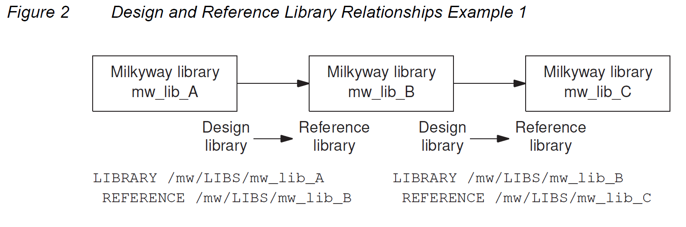
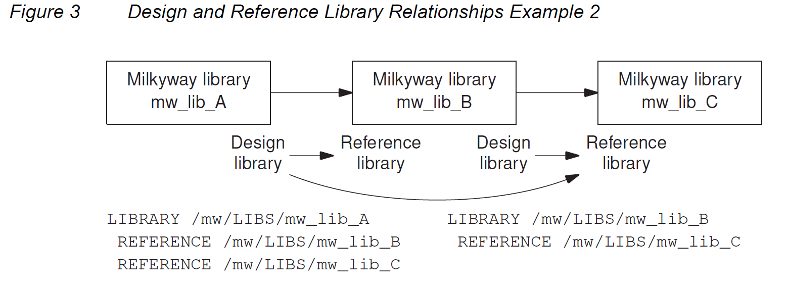
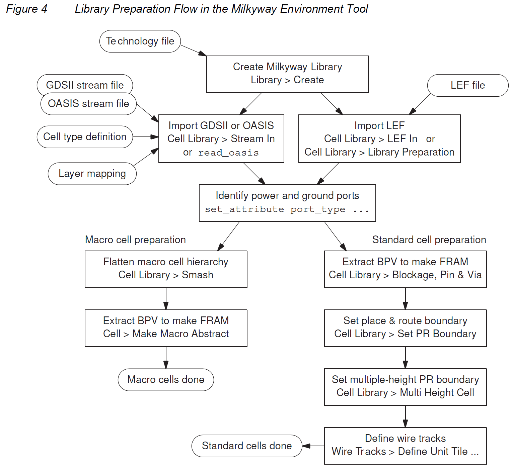

本文档是 Milkyway™ Database Application Note Version J-2014.09, September 2014 的中文翻译版本，旨在为中文用户提供更易于理解的物理设计学习资料，如有翻译不当的地方，欢迎发送邮件进行指正。

<h2 id="1.">1. Milkyway 数据库</h2>

Milkyway 数据库是 Synopsys Galaxy™ 设计平台的统一设计存储格式。该数据库提供物理设计数据的持久存储，将 Galaxy 平台工具连接在一起。数据库会定期更新新功能，以支持 EDA 技术的进步。

Milkyway 数据库的基本特性将在以下部分中描述：

* [1.1 Milkyway 数据库概述](#1.1)

* [1.2 Milkyway 数据库的版本](#1.2)

* [1.3 Milkyway 库和单元](#1.3)

* [1.4 Milkyway 相关命令](#1.4)

* [1.5 物理库数据准备](#1.5)

* [1.6 数据库命名规则](#1.6)

<h3 id="1.1">1.1 Milkyway 数据库概述</h3>

Milkyway 数据库是 Synopsys Galaxy 设计平台的统一设计存储格式。该数据库提供持久的数据存储，将 Galaxy 平台工具连接在一起，从而消除了大型中间交换文件的需求，并防止了使用其他数据交换格式可能导致的设计意图丢失。Milkyway 数据库格式定期增加新功能，以支持工具特性，如信号完整性分析、功耗降低和良率提升。

Milkyway 数据库提供以下特性和优势：

- 经过生产验证的数据库，适用于所有 Galaxy 设计平台工具
- 支持最大规模的设计
- 支持最新的技术节点，包括 28 nm、20 nm、14 nm 及更先进的节点
- 通过 LEF 和 DEF 实现第三方数据输入到 Galaxy 平台

对于当今的大型设计，在实现阶段会生成大量数据。如果没有一个通用的数据库，工具必须通过 ASCII 设计交换文件进行通信，这会带来一系列问题，包括文件过大和传输时间过长、由于语义不匹配导致的错误，以及不同工具之间数据格式修订不一致。

Milkyway 数据库解决了 Galaxy 平台的这些问题，因为所有实现工具都可以直接通过二进制接口访问数据库。直接访问数据库消除了大型、缓慢的 ASCII 交换文件和不同工具功能之间的语义差距。每个工具都能以相同的方式查看数据，从而防止代价高昂的错误并减少设计迭代。

以下 Synopsys 工具使用 Milkyway 数据库：

- Design Compiler 使用 write_milkyway 命令将映射的、唯一化的设计写入 Milkyway 数据库，包括网表和综合约束。如果有的话，它还会写入 Synopsys 物理指导信息。它还可以将设计写成其他格式，如 .ddc 和 Verilog。
- IC Compiler 从 Milkyway 数据库读取物理设计信息和库单元信息，以执行布局、时钟树综合和布线。它将生成的芯片设计信息写回 Milkyway 数据库。
- Milkyway Environment 工具 从其他格式的物理数据（包括 GDSII、OASIS 和 LEF/DEF）准备新的库单元，并将新的库单元写入 Milkyway 数据库。Milkyway Environment 工具还可以用于复制、编辑和删除单元；以及执行阻塞、引脚和过孔（BPV）提取以生成 FRAM 视图。
- IC Validator 从 Milkyway 数据库读取物理设计信息，以执行设计规则检查（DRC）、电气规则检查（ERC）、版图与原理图一致性检查（LVS）和填充图案生成。它将结果写回数据库，以供 IC Compiler 读取和用于错误报告。
- PrimeRail 从 Milkyway 数据库中的 CEL 和 FRAM 视图读取物理设计数据，以执行 IR 压降和电迁移分析。在某些情况下，它从 CONN 视图读取连接信息。
- StarRC 从 Milkyway 数据库读取物理设计信息，以执行寄生 RC 提取。它将结果写回数据库，以供 IC Compiler 读取和用于时序和串扰分析。
- 旧工具 如 JupiterXT™、Astro® 和 Hercules™ 以类似于相应当前工具的方式使用 Milkyway 数据库。

有关使用 Synopsys 工具与 Milkyway 数据库的详细信息，请参阅 SolvNet 上提供的各个工具的文档。Milkyway Environment 工具可用于 Milkyway 库的维护和库单元的准备，具体描述见 SolvNet 上 IC Compiler 文档集中的《IC Compiler User Guide》的《Library Data Preparation》部分。

图 1 显示了使用 Milkyway 数据库的一些芯片设计和分析数据流。

<center>
    
    <br>
    <div style="color:orange; border-bottom: 1px solid #d9d9d9;
    display: inline-block;
    color: #999;
    padding: 2px;">
      图1 Milkyway 数据库在Galaxy设计平台中的应用
  	</div>
</center>

<h3 id="1.2">1.2 Milkyway 数据库的版本</h3>

Milkyway 数据库基础设施会定期更新以支持新的数据库功能。每个新版本的数据库称为“模式”。

表 1 显示了每个新 Milkyway 模式对应的最早 IC Compiler 和 Milkyway Environment 产品版本号。

| IC Compiler和Milkyway Environment 版本 | Milkyway 模式                    |
| -------------------------------------- | -------------------------------- |
| J-2014.09                              | 8.1                              |
| H-2013.03                              | 7.0                              |
| F-2011.09                              | 6.0                              |
| D-2010.03-SP1                          | 5.1 (compatible with schema 5.0) |
| D-2010.03                              | 5.0                              |
| C-2009.06                              | 4.0                              |
| B-2008.09                              | 3.2                              |
| A-2007.12                              | 2.0                              |

当 IC Compiler 或 Milkyway Environment 版本 J-2014.09 读取存储在模式 7 或更早版本下的 Milkyway 数据时，工具会自动将数据更新到模式 8.1。存储在模式 8.1 下的 Milkyway 数据与 IC Compiler 和 Milkyway Environment 版本 I-2013.12-SP3 及更高版本兼容。例如，IC Compiler 版本 I-2013.12-SP3 可以读取和更新存储在模式 8.1 下的 Milkyway 数据。然而，早于该版本的工具（如 IC Compiler 版本 I-2013.12）无法读取模式 8.1 数据。模式 8.1 数据无法转换回早期模式。

表 2 列出了与 Milkyway 模式 8.1 兼容的 Synopsys 工具及其版本号。

| Synopsys Tool Name | Tool Releases that Support Milkyway Schema 8.1 |
|--------------------|-----------------------------------------------|
| Custom Designer    | J-2014.12 and later. I-2013.12-SP2 and later can read schema 8.1 data; J-2014.12 uses schema 8.1 by default. |
| Design Compiler    | J-2014.09 and later. I-2013.12-SP4 and later can read schema 8.1 abstraction models. |
| Formality          | I-2013.12-SP4 and later |
| IC Compiler        | J-2014.09 and later. I-2013.12-SP3 through I-2013.12-SP5 can read and write both schema 7 and schema 8.1 data. |
| IC Validator       | I-2013.12-SP2-1 and later |
| PrimeRail          | I-2013.12-SP3 and later for the default layer mode; support for the extended layer mode is planned for a future release |
| PrimeTime suite    | J-2014.06 and later |
| StarRC             | I-2013.12-SP3-1 and later; writes PARA data but not CEL data; no implicit conversion |
| TetraMAX ATPG      | J-2014.09 and later; reads X-Y coordinates of cell nets and topologies only |

注意： 最新版本的 Hercules 和 PrimeYield LCC 使用模式 5。没有计划更新 Astro 或 JupiterXT 的 Milkyway 数据库支持。MVRC（MVtools）和 Library Compiler 不使用 Milkyway 数据库。

你可以使用 IC Compiler 或 Milkyway Environment 工具中的 `convert_mw_lib` 命令，将 Milkyway 单元和库从以前的模式显式转换为当前的 Milkyway 模式。

如果你没有显式转换数据，当你使用最新版本的工具打开 Milkyway 单元时，工具会自动转换该单元并发出转换消息。你应该在关闭库之前保存转换后的单元。否则，当你重新打开该单元时，需要再次进行转换。

使用 `convert_mw_lib` 命令可以确保你的库数据完全转换，并且比逐个转换单元更高效。有关更多信息，请参阅《Library Data Preparation for IC Compiler User Guide》中的“Milkyway Database Versions”部分。

<h3 id="1.3">1.3 Milkyway 库和单元</h3>

物理库包含有关设计中放置的单元几何形状的信息，并与电源、地、时钟和信号线路连接。该库信息包括单元尺寸、边界、引脚位置和掩模层，以及技术信息，如布线轨迹、天线规则和电迁移数据。

物理库信息保存在 Milkyway 数据库中。Synopsys 工具可以访问数据库中的设计和库信息。数据库不仅包含叶级物理单元信息和技术信息，还包含设计特定的物理信息，如设计的布局和布线。

Milkyway 数据库组织为数据文件的层次结构。然而，你不能直接使用操作系统命令（如 cp 和 rm）创建、删除、复制或编辑这些文件。相反，你应该使用兼容的工具（如 IC Compiler 或 Milkyway Environment）并使用工具命令读取、写入或更改数据库内容。这确保了数据库的一致性和完整性。

在 Design Compiler、IC Compiler 或 Milkyway Environment 工具中，你可以使用 `open_mw_lib` 命令打开 Milkyway 数据库以进行查看或编辑。默认情况下，打开 Milkyway 库会使该库对工具可读写物理设计信息。一次只能打开一个 Milkyway 设计库。然而，设计可以包含对其他 Milkyway 库中单元的引用，这些库称为参考库。多个用户可以在不同的会话中打开同一个设计库。然而，一次只有一个用户可以获得写入 Milkyway 设计库的权限。

在 Milkyway 库中，基本的信息单位是单元（Cell）。单元是芯片布局中物理结构的表示，可以是简单的 I/O pad，也可以是整个芯片这样的大型复杂结构。在 IC Compiler 或 Milkyway Environment 工具中，你可以使用 `open_mw_cel` 命令打开单元进行编辑。该单元必须包含在当前打开的 Milkyway 库中。

芯片设计通常构建为单元的层次结构。整个芯片是由低级块构建的单个单元，这些块也是单元。这些块由更小的块构建，依此类推，直到叶级单元，即门级标准单元。

<h4 id="1.3.1">1.3.1 Cell Views</h4>

Milkyway 数据库可以包含同一单元的不同表示，称为该单元的“视图”。以下是物理实现工具中使用的主要视图类型：

- CEL 视图：物理结构（如过孔、标准单元、宏单元或整个芯片）的完整布局视图；包含单元的布局、布线、引脚和网表信息。
- FRAM 视图：用于布局和布线的单元抽象表示；仅包含单元的金属阻塞、允许的过孔区域和引脚。
- FILL 视图：金属填充视图，用于芯片完成，没有逻辑功能，由 IC Compiler 中的 `signoff_metal_fill` 命令创建。
- CONN 视图：单元的电源和地网络表示，由 PrimeRail 或 IC Compiler 工具创建，并由 PrimeRail 工具用于 IR 压降和电迁移分析。
- ERR 视图：IC Compiler 工具中验证命令（如 `verify_zrt_route` 或 `signoff_drc`）发现的物理设计规则违规的图形视图。

存储在 Milkyway 库中的物理设计必须至少有一个 CEL 视图，该视图包含布局、布线和掩模生成所需的所有单元信息。这包括布局信息，如tracks、site rows和placement blockage；布线信息，如网表、引脚、布线指南和互连建模信息，以及用于最终掩模生成的所有掩模层几何形状。

每个宏单元通常都有一个 CEL 视图和一个 FRAM 视图。FRAM 视图是单元的抽象表示，仅包含布局和布线所需的信息，包括单元边界、引脚位置、过孔着陆区和不允许布线的金属阻塞区。从 CEL 视图创建 FRAM 视图的过程称为blockage、pin和过孔（BPV）提取。

每个门级标准单元也可以有一个 CEL 视图和一个 FRAM 视图。FRAM 视图用于布局和布线，而 CEL 视图仅用于生成芯片制造的最终掩模数据流。

不要尝试使用操作系统命令（如 cp 或 rm）直接在 Milkyway 数据库中复制、编辑或删除单元视图文件。相反，应使用兼容的工具（如 IC Compiler 或 Milkyway Environment）来对单元视图进行任何更改。

过去，Milkyway 数据库用于存储逻辑、时序和功率数据文件在 LM、TIM 和 PWR 视图中。然而，这些类型的信息现在通常存储在 Milkyway 数据库之外维护的文件中，如 .db 文件。

<h4 id="1.3.2">1.3.2 设计库和参考库</h4>

Milkyway 数据库包含实现和分析工具所需的物理库信息。数据库不仅包含叶级物理单元信息和技术信息，还包含设计特定的物理信息，如布局和布线结果。芯片设计通常使用多个库，组织为设计库和参考库的层次结构。

你打开进行编辑的 Milkyway 库称为设计库。一次只能打开一个设计库。一个库可以包含任意数量的单元。你可以同时打开和显示一个库中的多个单元。一个单元可以使用其他未打开库中的单元实例构建。这些其他库称为参考库。

在 Design Compiler、IC Compiler 或 Milkyway Environment 工具中，你可以使用 `open_mw_lib` 命令打开 Milkyway 设计库。在 IC Compiler 和 Milkyway Environment 工具中，你可以使用 `open_mw_cel` 命令打开该库中的单元进行编辑。

设计通常构建为单元的层次结构。整个芯片是由低级块构建的单个单元，这些块也是单元。这些块由更小的块构建，依此类推，直到叶级单元。这些单元的物理表示存储在 Milkyway 库中。

当你打开一个 Milkyway 库时，你可以对该库中的单元进行读写访问。包含你正在设计的打开库称为设计库。设计中的低级单元可以在同一个库中找到，也可以在其他未打开的 Milkyway 库中找到，这些库称为参考库。你正在设计的内容可能包含在参考库中定义的单元实例。

参考库通常包含你自己不修改的数据。例如，参考库可能包含由 ASIC 供应商提供的标准单元、由 IP 块销售商提供的知识产权，或由你公司其他团队设计的低级块。你自己创建或修改的设计信息必须存储在设计库中。

术语“设计库”和“参考库”描述了两个 Milkyway 库之间的单向关系。如果你定义 mw_lib_B 为设计库 mw_lib_A 的参考库，那么 mw_lib_B 中包含的单元可以用于构建 mw_lib_A 中包含的单元。然而，这并不意味着 mw_lib_A 中包含的单元可以用于构建 mw_lib_B 中的单元。

一个给定的 Milkyway 库可以同时作为设计库和参考库。例如，你可以定义 mw_lib_B 为 mw_lib_A 的参考库，并定义 mw_lib_C 为 mw_lib_B 的参考库。那么 mw_lib_C 中的单元可以用于构建 mw_lib_B 中的设计，而 mw_lib_B 中的单元可以用于构建 mw_lib_A 中的单元。因此，mw_lib_B 是 mw_lib_A 的参考库，同时也是 mw_lib_C 的设计库，如图 2 所示。

<center>
    
    <br>
    <div style="color:orange; border-bottom: 1px solid #d9d9d9;
    display: inline-block;
    color: #999;
    padding: 2px;">
      图2 Milkyway 设计库和参考库的关系例一
  	</div>
</center>

每个参考库定义都是一级深度。在图 2 中，mw_lib_C 中的单元不能直接用于 mw_lib_A，因为关系是两级深度。然而，库 mw_lib_C 也可以显式定义为 mw_lib_A 的参考库，这将允许其单元直接用于 mw_lib_A。见图 3。

<center>
    
    <br>
    <div style="color:orange; border-bottom: 1px solid #d9d9d9;
    display: inline-block;
    color: #999;
    padding: 2px;">
      图3 Milkyway 设计库和参考库的关系例二
  	</div>
</center>

当前打开的 Milkyway 库是设计库。包含可读访问单元的相关 Milkyway 库是参考库。你可以使用 `set_mw_lib_reference` 命令定义设计库和参考库之间的关联。

<h5 id=1.3.2.1>1.3.2.1 设置 Milkyway 参考库</h5>

在 Design Compiler、IC Compiler 或 Milkyway Environment 工具中，`set_mw_lib_reference` 命令定义了与指定 Milkyway 设计库关联的 Milkyway 参考库。要使用此命令，Milkyway 设计库必须关闭。如果设计库当前是打开的，请先使用 `close_mw_lib` 命令将其关闭。

你可以在命令本身中显式指定参考库列表，或者在一个单独的文本文件中指定，该文件称为参考控制文件。你必须指定相对或绝对路径到顶级 Milkyway 目录名称。

例如，要将 Milkyway 库 mw_lib_B 和 mw_lib_C 定义为设计库 mw_lib_A 的参考库，首先在 mw_lib_A 打开时将其关闭。然后使用以下命令：

```tcl
prompt> set_mw_lib_reference \
        -mw_reference_library {/mw/LIBS/mw_lib_B /mw/LIBS/mw_lib_C} \
        /mw/LIBS/mw_lib_A
```

要使用外部文件而不是在命令中显式列出参考库，请使用以下命令：
```tcl
prompt> set_mw_lib_reference \
        -reference_control_file my_refs_A /mw/LIBS/mw_lib_A
```

你需要指定参考控制文件以及 Milkyway 设计库的绝对或相对路径。文件格式将在下一节中描述。

要生成显示特定设计库定义的参考库列表的报告，请使用 `report_mw_lib` 命令和 `-mw_reference_library` 选项。例如：

```tcl
prompt> report_mw_lib -mw_reference_library mw_lib_A
        /mw/LIBS/mw_lib_B
        /mw/LIBS/mw_lib_C
```

如果你没有指定要报告的 Milkyway 设计库，则报告当前打开的 Milkyway 库。

<h5 id=1.3.2.2>1.3.2.2 Milkyway 参考控制文件</h5>

你可以使用称为参考控制文件的 ASCII 文本文件指定与 Milkyway 设计库关联的 Milkyway 参考库。当你使用 `-reference_control_file` 选项时，`set_mw_lib_reference` 命令会调用此文件。

参考控制文件的语法如下：

```ASCII
LIBRARY path_to_mw_design_library_directory
REFERENCE path_to_mw_reference_library_directory
REFERENCE path_to_mw_reference_library_directory
...
```

例如：

```ASCII
LIBRARY /mw/LIBS/mw_lib_A
REFERENCE /mw/LIBS/mw_lib_B
REFERENCE /mw/LIBS/mw_lib_C
```

在此示例中，mw_lib_B 和 mw_lib_C 是设计库 mw_lib_A 的参考库。参考库中包含的单元可以用作构建设计库中包含的单元的实例。

指定 Milkyway 设计库和参考库的绝对路径，而不是相对路径。

要让工具从已经定义了参考库的现有 Milkyway 设计库中自动生成参考控制文件，请使用 `write_mw_lib_files` 命令和 `-reference_control_file` 选项。例如，要为库 mw_lib_A 生成名为 my_refs_A 的参考控制文件，请使用以下命令：

```tcl
prompt> write_mw_lib_files -reference_control_file \
        -output my_refs_A /mw/LIBS/mw_lib_A
```

这可以在 mw_lib_A 库打开或关闭时完成。然而，你必须指定设计库的绝对或相对路径。

<h4 id="1.3.3">1.3.3 逻辑库</h4>

单元的逻辑、时序和功率信息通常包含在一组 Synopsys 数据库 (.db) 文件中，这些文件与 Milkyway 数据库分开维护。.db 文件由 Library Compiler 工具从 Liberty (.lib) 格式的一组技术特征文件生成。

Liberty (.lib) 文件是 ASCII 格式文件，全面描述了叶级逻辑单元的逻辑、时序和功率特性。Library Compiler 工具将 .lib 文件编译生成 .db 文件，这些 .db 文件以编译的二进制格式包含与 .lib 文件相同的信息，更适合 Galaxy 工具使用。在 Design Compiler 或 IC Compiler 工具中，你可以通过设置 `search_path`、`target_library` 和 `link_library` 变量来指定 .db 文件。

逻辑库中的单元名称必须与 Milkyway 数据库中物理库中的相应单元名称匹配。你可以使用 Design Compiler、IC Compiler 或 Milkyway Environment 工具中的 check_library 命令验证逻辑库和物理库是否正确匹配。

<h3 id="1.4">1.4 Milkyway 相关命令</h3>

表 3 列出了 IC Compiler 和 Milkyway Environment 工具中与 Milkyway 相关的命令，并简要描述了这些命令。这些命令允许你打开、编辑和关闭 Milkyway 库和单元。

注意： 你不能直接使用操作系统命令（如 cp 或 rm）创建、复制、编辑或删除 Milkyway 数据库文件。相反，应使用兼容的工具（如 IC Compiler 或 Milkyway Environment）并使用工具命令编辑数据库内容。这确保了数据库的一致性和完整性。

| Command                   | Action performed                                                                 |
|---------------------------|----------------------------------------------------------------------------------|
| check_library             | Checks logical and physical libraries for quality and consistency                 |
| close_mw_cel              | Closes one or more open cells in the open Milkyway library                        |
| close_mw_lib              | Closes the current Milkyway library                                               |
| convert_mw_lib            | Converts the design data in a Milkyway library to the current schema              |
| copy_mw_cel               | Copies a cell to create a new cell in the current Milkyway library                |
| copy_mw_lib               | Copies a Milkyway library                                                        |
| create_mw_cel             | Creates a new cell in the current Milkyway library                                |
| create_mw_lib             | Creates a new Milkyway library                                                    |
| current_mw_cel            | Specifies or reports the current cell on which commands operate                   |
| current_mw_lib            | Reports the current Milkyway library; creates a collection containing that library|
| extend_mw_layers          | Extends the number of layers supported by the tool                                |
| get_mw_cels               | Creates a collection of cells in the current Milkyway library that meet specified criteria |
| list_mw_cels              | Lists the cells contained in the current Milkyway library                         |
| move_mw_cel_origin        | Moves the origin of a Milkyway design                                             |
| open_mw_cel               | Opens a cell in the current Milkyway library for viewing or editing               |
| open_mw_lib               | Opens a Milkyway library for editing, making it the current Milkyway library      |
| rebuild_mw_lib            | Rebuilds a Milkyway library by scanning all cells in the library directory        |
| remove_mw_cel             | Removes cells from the current Milkyway library                                   |
| report_milkyway_version   | Reports the data file version number, Milkyway schema version, and creation information for a cell |
| rename_mw_cel             | Renames a cell in the current Milkyway library                                    |
| rename_mw_lib             | Renames a Milkyway library                                                       |
| report_mw_lib             | Reports the unit range or reference libraries of a Milkyway library               |
| save_mw_cel               | Saves an edited cell into the current Milkyway library                            |
| set_mw_lib_reference      | Sets the lower-level reference Milkyway libraries associated with a given Milkyway library |
| set_mw_technology_file    | Sets a technology file (.tf, .plib, or .alf) associated with the current Milkyway library |
| set_stream_layer_map_file | Saves a stream-in or stream-out layer mapping file into a Milkyway library        |
| split_mw_lib              | Copies a specified design and its subdesigns in a Milkyway library into new, separate Milkyway libraries |
| write_mw_lib_files        | Writes the library technology information or library reference information to a file |

表 4 列出了 Design Compiler 工具中使用的与 Milkyway 相关的命令，并简要描述了这些命令。这些命令允许你打开、编辑和关闭 Milkyway 库，但不能单独编辑单元。Design Compiler 工具允许你使用 `open_mw_lib` 命令打开 Milkyway 库，使用 `write_milkyway` 命令将当前设计写入 Milkyway 单元，并使用 `close_mw_lib` 命令关闭库。

| Design Compiler Command   | Action Performed                                                                 |
|---------------------------|----------------------------------------------------------------------------------|
| check_library             | Checks logical and physical libraries for quality and consistency                 |
| close_mw_lib              | Closes the current Milkyway library                                               |
| copy_mw_lib               | Copies a Milkyway library                                                        |
| create_mw_lib             | Creates a new Milkyway library                                                    |
| current_mw_lib            | Reports the current Milkyway library; creates a collection containing that library|
| extend_mw_layers          | Extends the number of layers supported by the tool                                |
| open_mw_lib               | Opens a Milkyway library for editing, making it the current Milkyway library      |
| rebuild_mw_lib            | Rebuilds a Milkyway library by scanning all cells in the library directory        |
| rename_mw_lib             | Renames a Milkyway library                                                       |
| report_mw_lib             | Reports the unit range or reference libraries of a Milkyway library               |
| set_mw_lib_reference      | Sets the lower-level reference Milkyway libraries associated with a given Milkyway library |
| set_mw_technology_file    | Sets a technology file (.tf, .plib, or .alf) associated with the current Milkyway library |
| write_milkyway            | Writes the design information into a cell in the Milkyway database, including the floorplan, placement, and routing data, if any; the mw_design_library variable must be set first |
| write_mw_lib_files        | Writes the library technology information or library reference information to a file |

<h3 id="1.5">1.5 物理库数据准备</h3>

在 IC 设计流程中，一个重要任务是从外部来源获取的物理数据中准备标准单元和宏单元。这些信息通常以以下标准数据交换格式之一提供：

- GDSII 流格式，一个成熟的行业标准数据交换格式，用于集成电路布局信息
- OASIS，一种较新的数据流格式，设计为 GDSII 的改进替代品
- LEF/DEF，一组用于物理库（库交换格式）和设计数据（设计交换格式）的标准数据交换格式

图 4 总结了使用 Milkyway Environment 工具进行库单元准备的步骤。首先创建一个新的 Milkyway 库。然后导入 GDSII、OASIS 或 LEF/DEF 格式的物理数据，并提供创建库中单元的 Milkyway CEL 模型所需的任何附加信息。接着指定电源和地端口，创建单元的 FRAM 视图，并指定 FRAM 模型中所需的其他物理属性。具体步骤取决于你是准备宏单元还是标准单元。

<center>
    
    <br>
    <div style="color:orange; border-bottom: 1px solid #d9d9d9;
    display: inline-block;
    color: #999;
    padding: 2px;">
      图4 Milkyway Environment 工具中的库准备流程
  	</div>
</center>

有关 Milkyway Environment 工具中库数据准备流程的详细信息，请参阅 SolvNet 上 IC Compiler 文档集中的《Library Data Preparation for IC Compiler User Guide》。

<h3 id="1.6">1.6 数据库命名规则</h3>

Milkyway 数据库中的对象必须遵循某些命名规则。如果你计划将数据库与其他工具一起使用或将数据导出到其他格式，你还需要遵循这些工具或格式的规则。

<h4 id="1.6.1">1.6.1 字符限制</h4>

对于大多数数据库对象，名称可以包含任何字符，但对于库和单元，名称限制为以下字符：

- 字母字符（abc …）
- 数字字符（0123456789）
- 下划线（_）
- 美元符号（$）
- 竖线符号（\|）

单元名称还可以包含以下由 Synopsys 工具添加的特殊功能字符：

- 句点（.）将单元名称与其扩展名分开，表示单元的类型。
- 分号（;）将单元名称（包括扩展名）与其版本号分开。例如，cellA.cel;2 表示 cellA.cel 的第 2 版。


<h4 id="1.6.2">1.6.2 名称长度限制</h4>

表 5 显示了 Milkyway 数据库对象名称的最大允许长度。

| Object Type                          | Name Length Limitation                |
|--------------------------------------|---------------------------------------|
| application                          | 31 characters                         |
| cell                                 | 128 characters                        |
| cell instance                        | 1,023 characters                      |
| color (defined in the technology file)| 31 characters                         |
| contact (defined in the technology file)| 31 characters                         |
| error class                          | 15 characters                         |
| group                                | 31 characters                         |
| layer                                | 31 characters                         |
| library                              | 255 characters                        |
| line style (defined in the technology file)| 15 characters                         |
| mask layer (defined in the technology file)| 31 characters                         |
| net                                  | 1,023 characters                      |
| pad                                  | 31 characters                         |
| pin                                  | 31 characters                         |
| port                                 | 1,023 characters                      |
| property                             | 35 characters                         |
| reference library                    | 127 characters                        |
| region pin                           | 31 characters                         |
| stipple pattern (defined in the technology file)| 15 characters                         |
| technology file                      | 31 characters                         |
| tile array class (defined in the technology file)| 31 characters                         |
| tile array class subtile (defined in the technology file)| 31 characters                         |
| units (defined in the technology file)| 31 characters                         |
