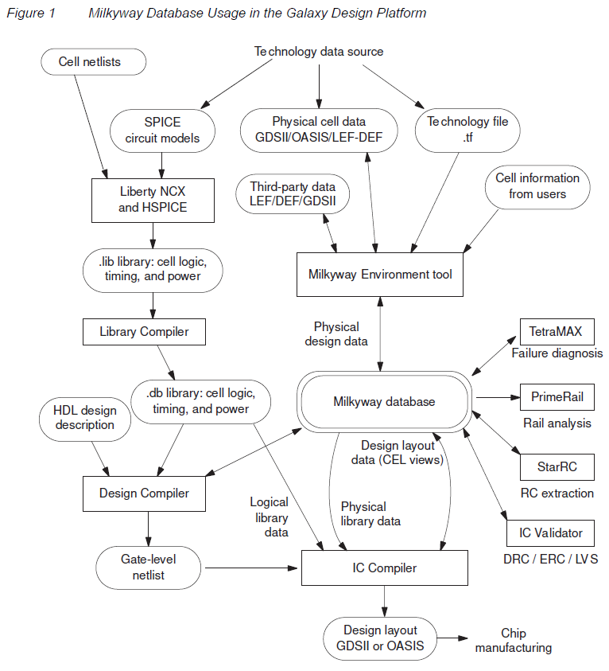

本文档是 Milkyway™ Database Application Note Version J-2014.09, September 2014 的中文翻译版本，旨在为中文用户提供更易于理解的物理设计学习资料，如有翻译不当的地方，欢迎发送邮件进行指正。

<h2 id="1.">1. Milkyway 数据库</h2>

Milkyway 数据库是 Synopsys Galaxy™ 设计平台的统一设计存储格式。该数据库提供物理设计数据的持久存储，将 Galaxy 平台工具连接在一起。数据库会定期更新新功能，以支持 EDA 技术的进步。

Milkyway 数据库的基本特性将在以下部分中描述：

* [1.1 Milkyway 数据库概述](#1.1)

* [1.2 Milkyway 数据库的版本](#1.2)

* [1.3 Milkyway 库和单元](#1.3)

* [1.4 Milkyway 相关命令](#1.4)

* [1.5 物理库数据准备](#1.5)

* [1.6 数据库命名规则](#1.6)

<h3 id="1.1">1.1 Milkyway 数据库概述</h3>

Milkyway 数据库是 Synopsys Galaxy 设计平台的统一设计存储格式。该数据库提供持久的数据存储，将 Galaxy 平台工具连接在一起，从而消除了大型中间交换文件的需求，并防止了使用其他数据交换格式可能导致的设计意图丢失。Milkyway 数据库格式定期增加新功能，以支持工具特性，如信号完整性分析、功耗降低和良率提升。

Milkyway 数据库提供以下特性和优势：

- 经过生产验证的数据库，适用于所有 Galaxy 设计平台工具
- 支持最大规模的设计
- 支持最新的技术节点，包括 28 nm、20 nm、14 nm 及更先进的节点
- 通过 LEF 和 DEF 实现第三方数据输入到 Galaxy 平台

对于当今的大型设计，在实现阶段会生成大量数据。如果没有一个通用的数据库，工具必须通过 ASCII 设计交换文件进行通信，这会带来一系列问题，包括文件过大和传输时间过长、由于语义不匹配导致的错误，以及不同工具之间数据格式修订不一致。

Milkyway 数据库解决了 Galaxy 平台的这些问题，因为所有实现工具都可以直接通过二进制接口访问数据库。直接访问数据库消除了大型、缓慢的 ASCII 交换文件和不同工具功能之间的语义差距。每个工具都能以相同的方式查看数据，从而防止代价高昂的错误并减少设计迭代。

以下 Synopsys 工具使用 Milkyway 数据库：

- Design Compiler 使用 write_milkyway 命令将映射的、唯一化的设计写入 Milkyway 数据库，包括网表和综合约束。如果有的话，它还会写入 Synopsys 物理指导信息。它还可以将设计写成其他格式，如 .ddc 和 Verilog。
- IC Compiler 从 Milkyway 数据库读取物理设计信息和库单元信息，以执行布局、时钟树综合和布线。它将生成的芯片设计信息写回 Milkyway 数据库。
- Milkyway Environment 工具 从其他格式的物理数据（包括 GDSII、OASIS 和 LEF/DEF）准备新的库单元，并将新的库单元写入 Milkyway 数据库。Milkyway Environment 工具还可以用于复制、编辑和删除单元；以及执行阻塞、引脚和过孔（BPV）提取以生成 FRAM 视图。
- IC Validator 从 Milkyway 数据库读取物理设计信息，以执行设计规则检查（DRC）、电气规则检查（ERC）、版图与原理图一致性检查（LVS）和填充图案生成。它将结果写回数据库，以供 IC Compiler 读取和用于错误报告。
- PrimeRail 从 Milkyway 数据库中的 CEL 和 FRAM 视图读取物理设计数据，以执行 IR 压降和电迁移分析。在某些情况下，它从 CONN 视图读取连接信息。
- StarRC 从 Milkyway 数据库读取物理设计信息，以执行寄生 RC 提取。它将结果写回数据库，以供 IC Compiler 读取和用于时序和串扰分析。
- 旧工具 如 JupiterXT™、Astro® 和 Hercules™ 以类似于相应当前工具的方式使用 Milkyway 数据库。

有关使用 Synopsys 工具与 Milkyway 数据库的详细信息，请参阅 SolvNet 上提供的各个工具的文档。Milkyway Environment 工具可用于 Milkyway 库的维护和库单元的准备，具体描述见 SolvNet 上 IC Compiler 文档集中的《IC Compiler User Guide》的《Library Data Preparation》部分。

图 1 显示了使用 Milkyway 数据库的一些芯片设计和分析数据流。

    
     
    

      图1 Milkyway 数据库在Galaxy设计平台中的应用
  	

