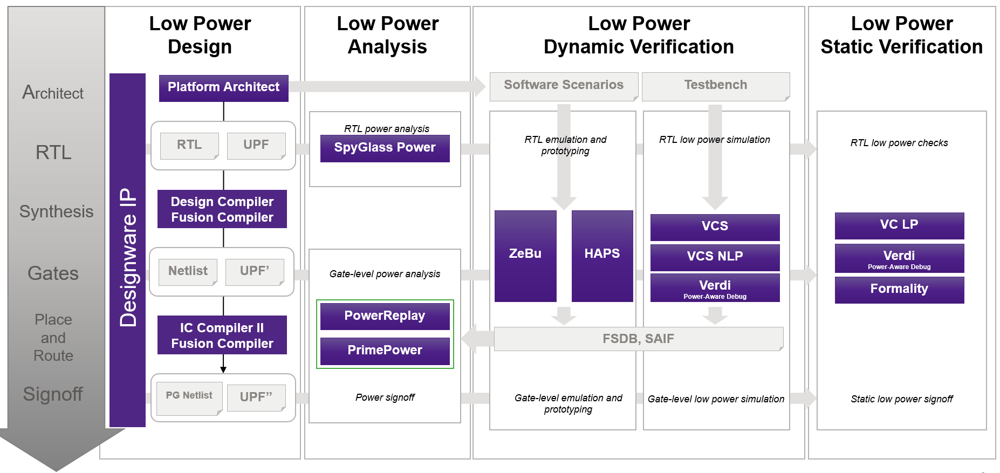

图24展示了Synopsys多电压综合、实现和验证流程。该流程从设计逻辑的寄存器传输级（RTL）描述开始，并附有单独的设计电源意图的UPF描述。RTL和UPF描述包含在不同的文件中，以便它们可以分别维护和修改。在此示例中，初始UPF描述被指定为UPF0文件。

    
     
    

      图24 基于Synopsys工具的多电压设计流程
  	

Design Compiler工具读取RTL逻辑和原始UPF电源意图描述，并根据其内容综合出门级网表和更新的UPF文件，在此示例中指定为UPF’（UPF prime）。UPF’文件包含原始UPF信息以及综合过程中创建的特殊单元的显式供电网络连接。

IC Compiler、IC Compiler II或Fusion Compiler工具读取门级网表和UPF’电源描述文件，并根据文件内容执行物理实现（布局和布线），生成修改后的门级网表、完整的电源和接地（PG）网表以及更新的UPF文件UPF’‘（UPF double-prime）。UPF’'文件包含UPF’信息以及物理实现过程中对低功耗电路结构（如电源开关）的任何修改。

此流程中使用的数据文件可用于VCS模拟器的功能验证、Formality工具的形式等效性检查以及PrimeTime、PrimePower和PrimeRail工具的时序和功耗验证。

VCS NLP多电压仿真工具可用于在流程的不同阶段对具有多电压特性的设计进行功能验证：在综合前的RTL级别、综合后添加电源相关单元的门级以及添加电源开关后的布局和布线阶段。在每个级别，VCS NLP仿真设计以验证电压变化对电源管理芯片的影响，使您能够准确可靠地检测任何低功耗设计问题。VC LP工具检查多电压规则的遵守情况，并报告与电源连接、电源架构或电源意图一致性相关的任何问题。

PrimeTime工具读取综合或物理实现工具生成的门级网表，并读取这些工具生成的UPF描述。它使用UPF信息构建电源网络的虚拟模型，并适当地在设计中每个叶级门实例的每个电源引脚上注释电压值。PrimeTime工具不会以任何结构或功能方式修改电源域描述，因此不会写出任何UPF命令。

有关跨越多个Synopsys工具（从综合到验证工具）的Synopsys多电压流程相关文档的链接，请参阅以下SolvNetPlus文章：

[SolvNetPlus article 025518, "UPF and Multivoltage Flow Documentation References."](https://solvnetplus.synopsys.com/s/article/UPF-and-Multivoltage-Flow-Documentation-References-1576165801404)

注意： 您必须登录SolvNetPlus才能直接连接到文章。如果在点击文章链接时提示您登录SolvNetPlus，请登录，然后再次点击链接以访问文章。