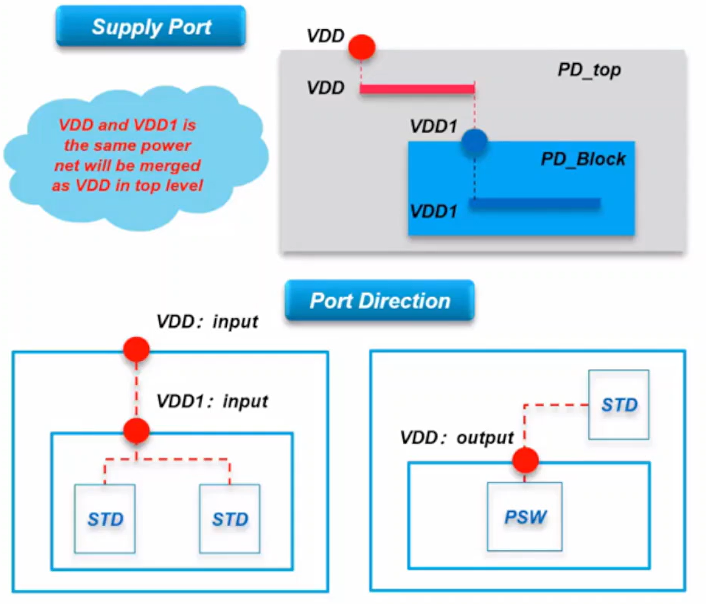
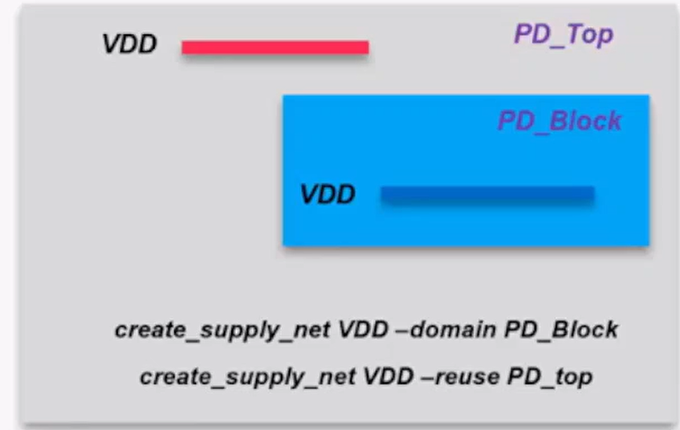
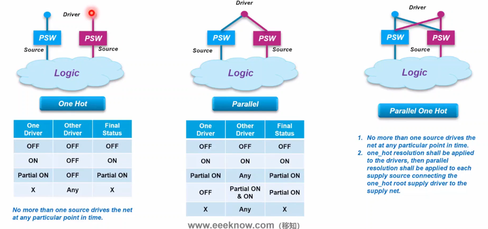
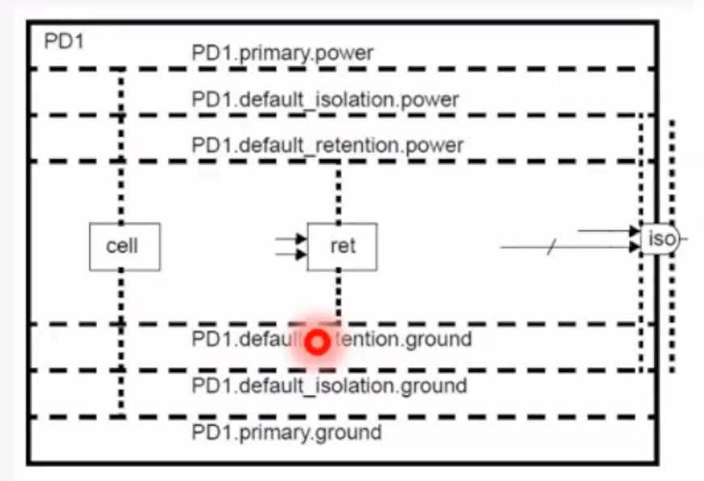
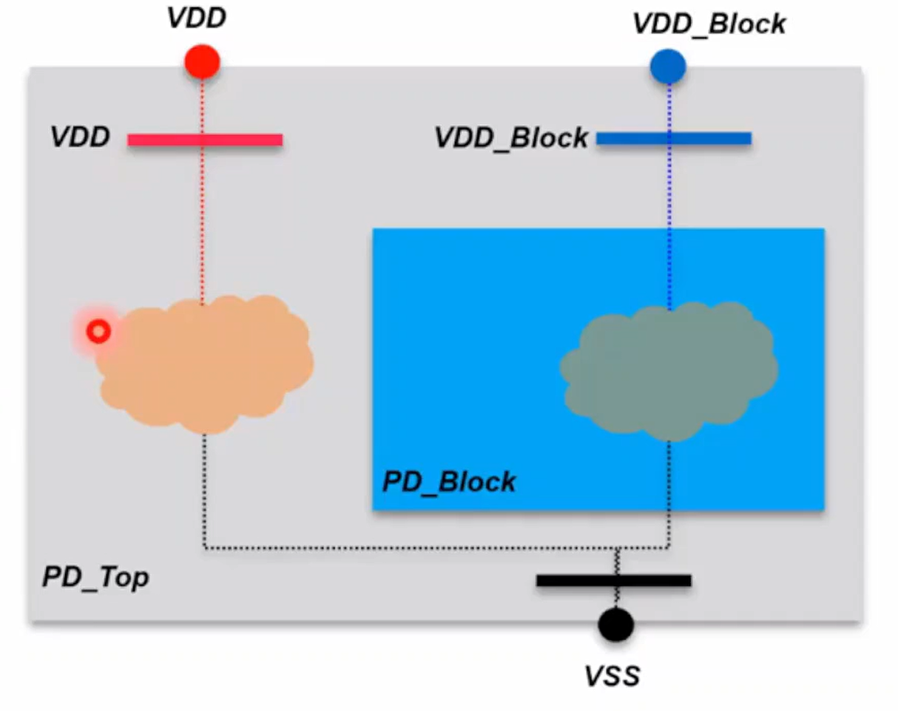
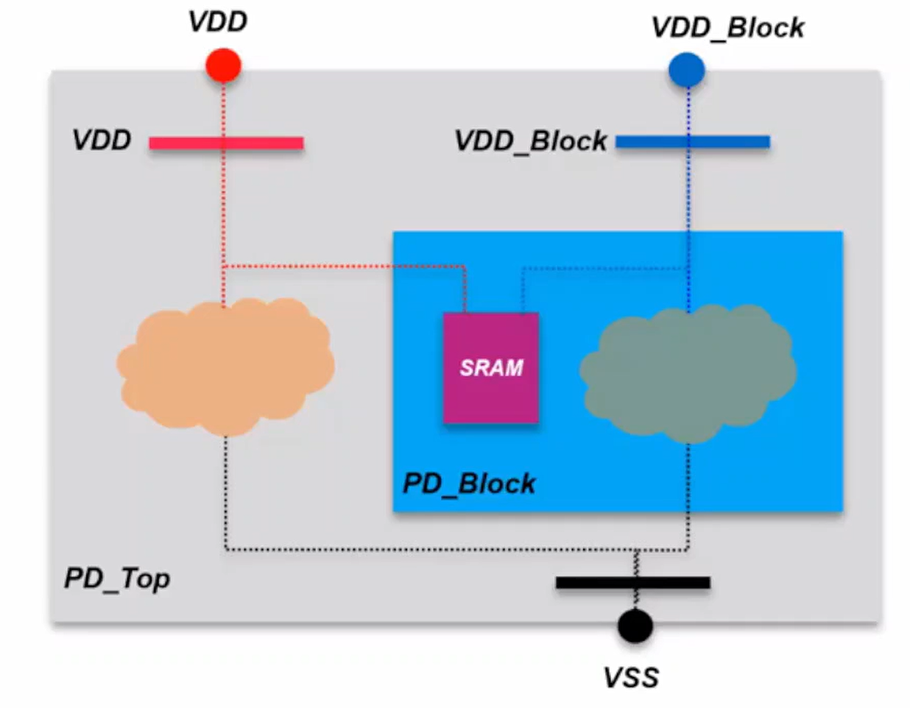

## Supply Port 介绍

定义：电源/地网络的”**逻辑源头**“，即电源网络在不同范围的连接点。（物理上不存在对应的物理端口）

命令及可选项：

```tcl
create_supply_port port_name
    [-domain domain_name]
    [-direction <in | out | inout>]
```
- port Name：通常与同一范围内的电源网络相同
- domain：该端口所在的电源域定义了一个电源网络连接点。
- direction：in/out/inout，代表电流的方向；工具应遵循Liberty中为PG端口指定的方向；通常在UPF中将电源端口定义为“inout”或“input”
    - power switch向scope外的单元供电：output
    - 同时给同一scope供电：inout
<center>
    
    <br>
    <div style="color:orange; border-bottom: 1px solid #d9d9d9;
    display: inline-block;
    color: #999;
    padding: 2px;">
        Supply Port
  	</div>
</center>


## Supply Net 介绍

定义：硬件描述语言（HDL）对电源轨的表示。

- 明确设计中使用的电源网络；**所有PG网络都应在UPF中定义。**
- 此命令中未定义功能和电压。
- 每个电源网络都应连接到其端口或层级电源端口。

命令及可选项：

```tcl
create_supply_net net_name
    [-domain domain_name][-reuse]
    [-resolve <unresolved | one_hot | parallel | parallel_one_hot |resolution_ function_name >]
```

- net_name：来源于spec。
- domain：定义电源网络的作用域所在的电源域。
- reuse：电源网络将在另一个同名范围内使用。（少用）
- resolve：定义当供电网络由一个或多个电源开关驱动时，如何解析供电网络的状态和电压。（对实现没什么用，simulation可能有用）
    - unresolved：电源网络最多只能连接一个电源源。这是默认设置。
    - one_hot：多个电源源可以连接到电源网络，但任何时刻只能有一个源驱动网络，否则状态不确定。
    - parallel：多个电源源共享一个根电源驱动器，可以并联连接。如果所有电源都是FULL_ON，网络状态为FULL_ON；如果有电源是OFF且有电源是FULL_ON或PARTIAL_ON，网络状态为PARTIAL_ON。
    - parallel_one_hot：多个电源源可以连接到电源网络，每个源可以有多个路径连接到网络。任何时刻最多只有一个根电源驱动器是FULL_ON，其他源使用parallel解析。

<center>
    
    <br>
    <div style="color:orange; border-bottom: 1px solid #d9d9d9;
    display: inline-block;
    color: #999;
    padding: 2px;">
        Supply Net
  	</div>
</center>

<center>
    
    <br>
    <div style="color:orange; border-bottom: 1px solid #d9d9d9;
    display: inline-block;
    color: #999;
    padding: 2px;">
        Supply Net Resolve Option
  	</div>
</center>

## Supply Set 介绍

定义：一组电源功能的集合，整体上提供一个完整的电源。

- 一组给某个单元供电的相关的 power/ground/nwell/pwell/deeplnwell/deeppwell nets
- UPF 2.0 的语法，UPF 1.0不支持

命令及可选项：

```tcl
create_supply_set set_name
    [-function {func_name net_name}]*
    [-update]
```

- function：`-function` 选项定义了电源网络为该电源集提供的功能（`func_name`）。`net_name` 是电源网络或电源端口的根名称或电源网络句柄。如果 `net_name` 未在当前作用域中定义，则会出错。
    - 当指定 `-function` 选项时，`func_name` 应为以下之一：power、ground、nwell、pwell、deepnwell 和 deeppwell。
- update：更新一个已存在的供电集合，添加或修改-function选项。使用-update选项时，必须指定至少一个-function选项。


### Why Bother？

- 使RTL和综合级别的UPF编码更加容易
  - 在 UPF1.0 中，电源网络通常在设计流程的早期就已完全指定
  - 在UPF2.0（IEEE1801）中，抽象级Supply sets可用于逻辑网表
- 定义每个电源网络的功能并绑定到电源域，使物理PG连接更容易
- 定义PG网络的电源状态
- 用于比较信号网络中驱动器和接收器的覆盖关系

### Supply Set 和 Power Domain

- 每个电源域需要绑定一个Supply Set作为primary Supply Set，其他定义的Supply Set可以通过UPF控制在电源域内使用或不使用
    - primary supply set: 除非被覆盖，否则为电源域中所有实例推断的电源网络连接。（**给domain里面所有standard cell供电**）
- Supply Set不绑定到任何电源域，工具将为它创建一个internal power domain

### Supply Set Handle
- Supply Set的抽象表达方法
- 结构：Power domain 名字.关键字
- UPF自有的关键字
    - PD.primary：PD 的primary Supply Set
    - PD.default_isolation：PD 里的isolation cell的power/ground应该接的supply set
    - PD.default_retention：PD 里的retention cell的power/ground应该接的supply set

<center>
    
    <br>
    <div style="color:orange; border-bottom: 1px solid #d9d9d9;
    display: inline-block;
    color: #999;
    padding: 2px;">
        Supply Set Handle
  	</div>
</center>

## UPF 电源网络编码示例

### UPF Example 1

<center>
    
    <br>
    <div style="color:orange; border-bottom: 1px solid #d9d9d9;
    display: inline-block;
    color: #999;
    padding: 2px;">
        UPF Example 1
  	</div>
</center>

```tcl
create_supply_port VDD -direction inout
create_supply_net VDD
connect_supply_net VDD -ports VDD

create_supply_port VSS -direction inout
create_supply_net VSS
connect_supply_net VSS -ports VSS

create_supply_port VDD_Block -direction inout
create_supply_net VDD_Block
connect_supply_net VDD_Block -ports VDD_Block

create_supply_set SS_VDD_VSS \
-function {power VDD} \
-function {ground VSS}

create_supply_set SS_VDD_Block_VSS \   
-function {power VDD_Block} \
-function {ground VSS} 

create_power_domain PD_Top -include_scope \
-supply {primary SS_VDD_VSS}

create_power_domain PD_Block -elements Block \
-supply {primary SS_VDD_Block_VSS}
```

### UPF Example 2

<center>
    
    <br>
    <div style="color:orange; border-bottom: 1px solid #d9d9d9;
    display: inline-block;
    color: #999;
    padding: 2px;">
        UPF Example 2
  	</div>
</center>

```tcl
create_power_domain PD_Top -include_scope \
-supply {primary SS_VDD_VSS}

create_power_domain PD_Block -elements Block \
-supply {primary SS_VDD_Block_VSS}

connect_supply_net VDD -ports {VDD Block/SRAM/VDDCE}
```
