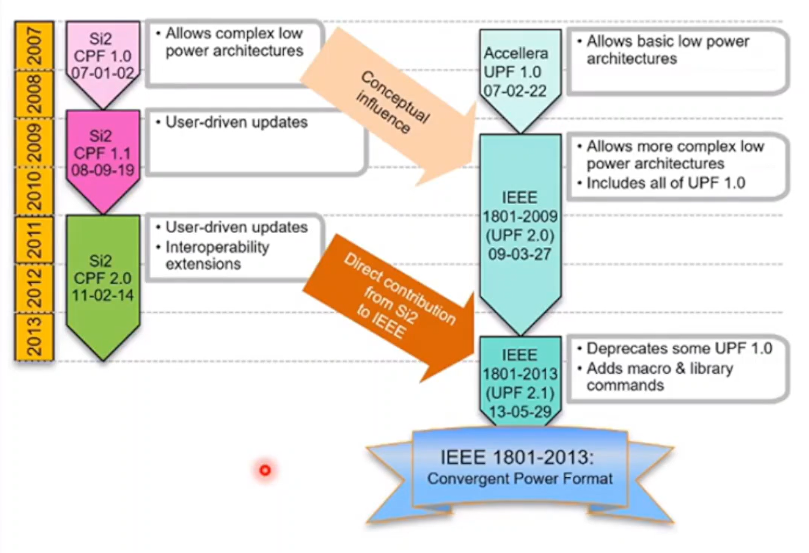

## 什么是Power Intent？

描述芯片低功耗架构，指导芯片编码(RTLDesign)、仿真 (simulation)、综合(Synthesis)、后端实现(Physical Design)与时序功耗验证(Sign Off)。

## Power Intent 种类

- CPF: Common Power Format (Cadence)
- UPF: Unified Power Format (All)

### UPF 发展历史

- UPF 1.0 标准（2007）
    - 以 supply net 为中心的电源意图
    - isolation/level shifter rool应用于电源域的输出或者输入
    - 基于object的过滤规则，跨电源域不能过滤
- IEEE 1801-2009 (UPF 2.0)标准
    - 引入 supply set
    - 为了识别真正的跨电源域，引入用于isolation和level shifter的过滤规则
    - 相较于UPF 1.0 带来很多其他的改进
    - 包括了完整的UPF 1.0的标准
- IEEE 1801-2013 (UPF 2.1)标准
    - 放弃有冲突的UPF1.0命令
    - 从CPF贡献中获益
    - 功耗模型和功耗管理单元命令修正了1801对liberty的依赖

    
     
    

      先进工艺制程PPA比较
  	

## UPF 适用的设计种类

- 多电压域架构(Multiple Supply Voltage)
- 电源关断 (Power Shut Off)
- 动态电压频率调节(DVFS:DynamicVoltage and Frequency Scaling)

## UPF 文件内容架构

- 电源网络（Power、Ground Nets）
- 电压域定义（Power Domain/Voltage Island）
- 芯片低功耗工作模式（Power State）
- 低功耗单元规则（Isoland、Shifter、Power Gating）
- 芯片边界供电定义（Boundry Ports）
- IP单元供电描述（GNC Rule）

## 物理实现

- 综合 (Genus) :
    - UPF:电压域划分，library绑定，输出带有低功耗单元的门级网表
- 物理设计(Innovus):
    - UPF电压域划分:指导芯片布局与电源规划UPF低功耗单元规则:指导自动布局
    - UPF电压域关系:指导物理优化与Buffering
    - UPF电压域划分:指导布线Signoff (Tempus/Voltus) :UPF电源网络:帮助电源电压确定
- 验证(Conformal Low Power Check)
    - 验证UPF语法与架构
    - 验证芯片低功耗架构，发现实现中出现的问题

