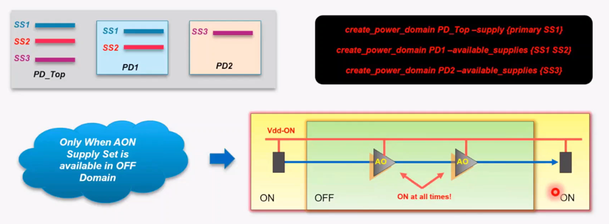

## Power Domain 介绍

定义：一组实例被视为一个整体进行电源管理。这些实例通常（但不总是）共享一个主电源集（primary supply set）。一个电源域还可以有额外的电源，包括保持电源和隔离电源。

```tcl
create_power_domain domain_name
    [-atomic]
    [-elements element_list]
    [-subdomains domain_list]
    [-exclude_elements exclude_list]
    [-supply {supply_set_handle [supply_set_ref]}]*
    [-available_supplies supply_set_ref_list]
    [-define_func_type {supply_ function pg_type_list}]*
    [-update]
```

- domain_name：电源域的名称，应到为当前scope内的简单名称。
    - 推荐的命名样式：PD_hierarchy_attribute, example: PD_cpu_high, PD_core_off
- elements：指定了一组包含在电源域范围内的根实例。
    - `-elements {.}`指的是当前scope内的所有实例。
- exclude_elements：排除在电源域范围内的根实例。
- supply：定义了电源域的supply set handle，primary/default_isolation/default_retention，用户定义handle
- available_supplies：定义了电源域的可用supply set。
    - 不定义时，当前power domain中的所有supply set都是逻辑上被用到。
- update：incremental更新。

### Scope

支持的scope类型：
- Hierarchical Instance (Module)：推荐
- Separate Instance (Buff1, Buff2)：不推荐
- IP Instance (Memory1, Memory2)：不推荐

原因：
- Separate Instance：物理设计期间不适用
- IP Instance：
    - 使用Hierarchical UPF：Low power cell易于插入
    - 只需将它们视为常规Instance：flow中更方便

### Power Domain 分类

- Default Domain：如果实例未包含在其他电源域定义中，则属于默认电源域。
- Internal Domain：工具（Cadence）将为不绑定任何电源域的“Supply Set”创建内部电源域，例如：_internal_VDD_VSS_domain。
- Virtual Domain：电源域不包含任何实例，在UPF过程中，内部电源域为虚拟电源域。（CPF中的概念）
- Physical Domain：PR流程中会去画fence的电源域。
- Logical Domain：PR流程中不会画fence的电源域，必须嵌套在Physical Domain中。
- Marco only Domain：仅包含Macro单元的电源域，被认为是Physical Domain。

### Supply Set Bind

- Primary Supply Set (PD.primary)：必须为每一个电源域指定。
- default_isolation & default_retention (PD.default_isolation & PD.default_retention)：不必要。
- User defined Supply Set：不必要。不是UPF flow中的关键词，有时能提高效率。
- Available Supply Set：电压域可以使用的电源，大多数应用于在电源域中引导always-on buffer的使用。

```tcl
create_power_domain PD_test
    -supply {primary SS_VDD_VSS}
    -supply {memory SS_VCS_VSS}
```

```tcl
create_power_domain PD_test
    -include_scope 
create_power_domain PD_test
    -supply {primary SS_VDD_VSS}
    -update
```

```tcl
create_power_domain PD_test
    -include_scope
associate_supply_set SS_VDD_VSS
    -handle PD_test.primary
```
<center>
    
    <br>
    <div style="color:orange; border-bottom: 1px solid #d9d9d9;
    display: inline-block;
    color: #999;
    padding: 2px;">
        Supply Set Bind
  	</div>
</center>

### example

<center>
    
    <br>
    <div style="color:orange; border-bottom: 1px solid #d9d9d9;
    display: inline-block;
    color: #999;
    padding: 2px;">
        Example
  	</div>
</center>

```tcl
create_power_domain PD_Top
    -include_scope
create_power_domain PD1
    -elements {iA iB}
    -exclude_elements {iA/iC}
create_power_domain PD2
    -elements {iB/iD}

associate_supply_set SS1 -handle PD_Top.primary
associate_supply_set SS2 -handle PD1.primary
associate_supply_set SS3 -handle PD2.primary

# PD2只能用默认的primary supply set
create_power_domain PD2
    -available_supplies {}
    -update
```

