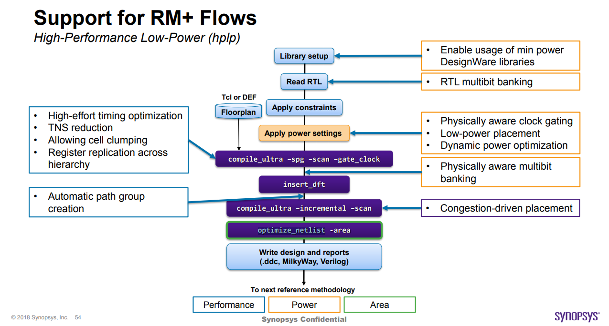
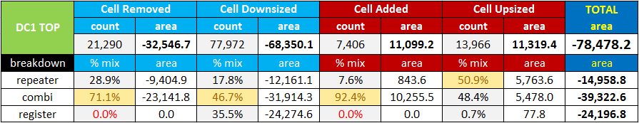
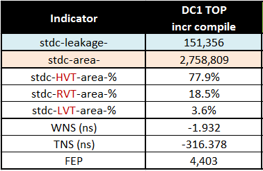
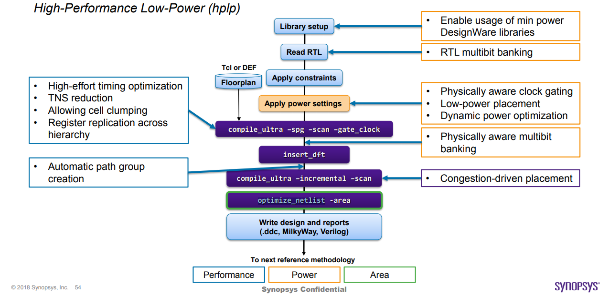
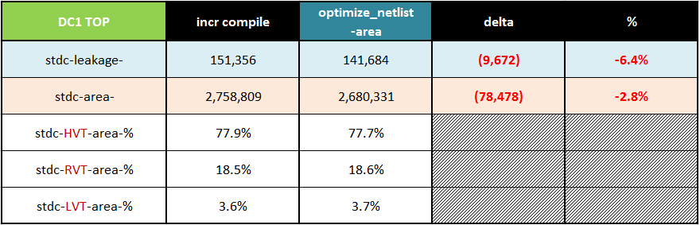

本文档是 Best Practices in Synthesis Area Recovery Using optimize_netlist (SNUG 2018) 的中文翻译版本，旨在为中文用户提供更易于理解的综合面积优化学习资料，如有翻译不当的地方，欢迎发送邮件进行指正。

原文链接：[Best Practices in Synthesis Area Recovery Using optimize_netlist (SNUG 2018)](https://www.synopsys.com/news/pubs/snug/2018/singapore/t1-06-lou-paper.pdf)

## 摘要

通常，由于广泛继承的遗留 IP 和现代 SoC 设计中的约束，面积回收并未完全有效。要彻底清理这些 RTL 和约束，相当于重新设计，这将极大地影响设计进度。当战略性地应用 Design Compiler 的 `optimize_netlist` 时，它将在不恶化 QoR 状态的情况下回收更多面积。提前完成面积回收还意味着设计平面图尺寸优化，从而为布局实施提供了现实的起点，并提供了更精确的功耗估算，这对可预测性和减少迭代是一个很大的优势。

在本文中，我们将探讨结合使用 `optimize_netlist` 和一些综合方法，以在时序、面积、功耗和可布线性之间取得平衡。对于具有 600 万实例的 40nm 多 VTH 设计，我们成功地在块级和顶层综合中实现了 3-5% 标准单元面积的一致节省。此外，我们还解决了其中一个块设计中的可布线性问题。

## 序言

现代 SoC 设计师通常面临的难题之一是如何在最短的设计周期内实现最小的芯片尺寸？实现这一目标意味着在满足市场需求的同时，将硬件成本保持在最低水平。看似简单的面积回收由于现代 SoC 设计中普遍存在的遗留知识产权（IP）和约束而未能完全有效。

要在将 IP 集成到 SoC 中时彻底清理这些 RTL 和约束，相当于重新设计，这将极大地影响设计进度。因此，清理过程通常在尽可能高的层次上尽快完成，留下大量顽固的浮动逻辑。这些浮动逻辑可能是由过期的“不可触碰”约束或保留的已不相关的设计层次结构（尤其在衍生设计中）创建的，但会对综合的整体优化效果，特别是门面积产生不利影响。

自 Design Compiler I-2013.12 以来，提供了一个独立的 `optimize_netlist -area` 命令，专门用于在综合网表级别进行面积回收，而不会恶化 QoR 状态。

在综合过程中提前进行面积回收的优势是多方面的。在平面图设计期间，设计平面图将被优化尺寸，从而为布局实施提供一个现实和最佳的起点。功耗估算将更加精确，这是可预测性和减少平面图设计和布局实施期间迭代次数的一个很大优势。

当面积减少时，漏电功耗通常会同步下降。因此，具有更高功耗要求的高性能设计不再是难以实现的目标。

在本文中，我们将探讨结合使用 `optimize_netlist -area` 命令和一些综合方法，以在时序、面积、功耗和可布线性（布局）之间取得平衡。对于具有 600 万实例的 40nm 多 VTH 设计，我们成功地在块级和顶层综合中实现了 3-5% 标准单元面积的一致节省。此外，我们还解决了其中一个块设计中的可布线性问题。

## 假设

除非另有说明：

- 功率单位为微瓦（uW），
- 面积单位为平方微米（micron²）。

在为本文收集信息期间，参考和指导如下：

- 高性能低功耗（HPLP）设计
- 设计：40nm，600万个实例，300MHz
- Design Compiler M-2016.03
- topographical
- 多电压
- 寄存器分组

为了便于理解，本文中使用的标准单元库定义（如表1所述）贯穿全文。

| 标准单元库类型 | 首字母缩写 | 定义 |
| --- | --- | --- |
|High VTH|HVT|低泄漏|
|Regular VTH|RVTH|标准泄漏|
|Low VTH|LVT|高泄漏|

## optimize_netlist 101

独立的 Design Compiler 命令用于面积恢复是 `optimize_netlist -area`。你可以参考 Synopsys 的 MAN 页面或 SolvNet 获取应用详情。该命令旨在执行单调的门到门优化以改善面积，而不降低时序或泄漏性能。

换句话说，它试图在不恶化延迟成本和功耗成本的情况下，最小化设计中的门数量。通常，它通过以下方式优化面积：
1. 门尺寸调整
2. 浮动逻辑移除（反相器/缓冲器/组合逻辑）
3. 组合逻辑优化
4. 顺序逻辑面积恢复

根据应用经验，大部分的面积节省来自于“门尺寸调整”。然而，请记住，这种统计数据因设计而异。`optimize_netlist -area` 通常建议作为综合流程结束时的最后一步面积恢复，如图1所示。它也可以应用于已经完成流片的设计网表，通常是为了成本降低（CR）步骤。如果对设计进行大批量订单，货币成本影响将是显著的。

    
     
    

      图1 综合流程末端的面积恢复
  	

`optimize_netlist -area` 是在 `compile_ultra`（DC Ultra）和 `compile`（DC Expert）期间的正常优化基础上进行的，这些优化也包括面积恢复。

通常，顺序逻辑面积恢复（浮动寄存器和常量寄存器）已经在 compile_ultra（DC Ultra）和 compile（DC Expert）期间完全优化。因此，在 `optimize_netlist -area` 期间很难再有顺序逻辑移除。如果有任何遗漏，`optimize_netlist -area` 将会解决这些问题。

关于面积恢复，有一个非常重要的注意事项，即面积成本函数总是比其他成本（如延迟成本）排名低，如编译成本函数中所述。因此，即使在面积优化期间，如果 Design Compiler 发现新的机会来改善延迟成本，它也会进行更改，即使这会增加面积成本。

因此，当我们统计 `optimize_netlist -area` 后的整体面积恢复时，我们会发现以下涉及的组件，其中（3）和（4）是通过改善整体延迟成本而增加的标准单元面积组件：

- 移除的单元
- 缩小的单元
- 添加的单元
- 放大的单元

请记住，尽管有单元放大和/或添加，整体面积恢复通常超过增量，结果是净面积节省，如表2所示。

    
     
    

      表2 面积恢复组件和数据
  	

## 优化面积

在第1章中，我们讨论了由于广泛继承遗留IP和约束而导致的综合过程中面积恢复的挑战。在本章中，我们将说明使用 `optimize_netlist -area` 的几种综合方法，这些方法将影响整体面积恢复结果以及泄漏减少。

让我们从调整综合后状态开始。如表3所示，在增量编译后，“DC1 TOP”设计使用了非常高比例的HVT标准单元，接近78%。这是因为该设计对功耗有非常严格的要求。

总标准单元泄漏值也被报告为衡量面积恢复对泄漏减少效果的指标。

    
     
    

      表3 DC1 TOP 标准单元比例和QoR
  	

图例：

- HVT == 低泄漏标准单元
- RVT == 标准泄漏标准单元
- LVT == 高泄漏标准单元
在当前状态下，综合后的时序质量（QoR）已经被分析、理解并认为足够好，可以进行布局实现。

对于那些不知情的人，仅仅通过查看高比例的HVT标准单元，可能会认为我们在面积恢复和泄漏功耗减少方面已经达到了饱和水平。

然而，不管你信不信，面积恢复和泄漏功耗减少仍然有改进的空间，具体将在下文中概述。

### 基础面积恢复

对于这种方法，我们在 `optimize_netlist -area` 期间不允许使用 LVT 单元，如图2所示。

LVT 单元具有更好的时序特性，但泄漏较高。如果在 `optimize_netlist -area` 期间允许使用它们，我们将看到几乎为零的泄漏减少作为最终结果（但不会变得更糟）。

    
     
    

      图2 典型面积恢复方法
  	

如表4所示，通过这种方法，我们能够实现：

- 面积恢复2.8%（78,478平方微米），以及
- 泄漏减少6.4%（9,672微瓦）

    
     
    

      表4 DC1 TOP 结果
  	

### 增强面积恢复

