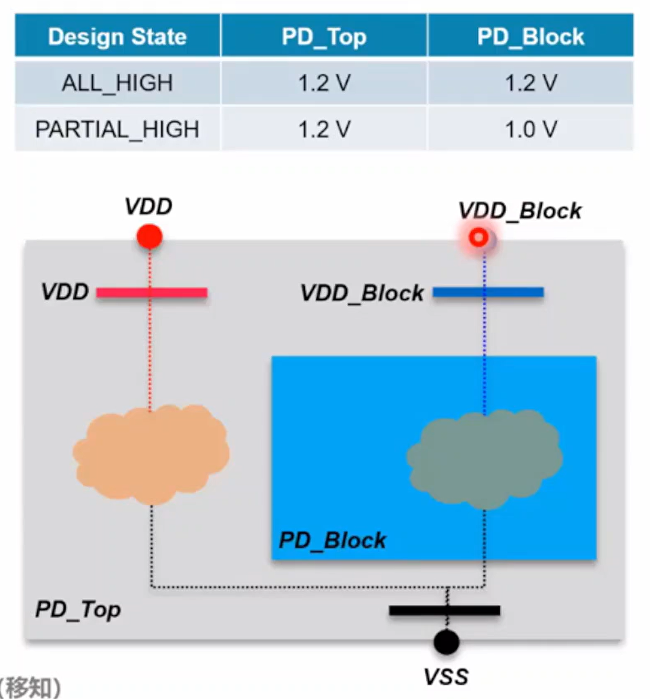

## Power State 介绍

定义：电源状态表定义了设计运行期间可以同时存在的合法状态组合
- 由其电源端口的一组开关状态和电压电平组成
- 用于综合、分析和优化

编码风格：
- supply port based
    - UPF 1.0 style, deprecated in UPF2.1, not recommended
    - Use `add_port_state`/`create_pst`/`add_pst`
- supply set based：
  - UPF 2.0 and 2.1, use `add_power_state`, **recommanded style**
- mixed style：
  - UPF 2.0 and 2.1, synopsys style, not recommended

<center>
    
    <br>
    <div style="color:orange; border-bottom: 1px solid #d9d9d9;
    display: inline-block;
    color: #999;
    padding: 2px;">
        Supply Port Based coding style
  	</div>
</center>

### Supply Port Based coding style

```tcl
add_port_state VDD -state{high 1.2}

add_port_state VDD_Block \
    -state {high 1.2} \
    -state {low 1.0}

add_port_state VSS -state{gnd 0}

create_pst PST -supplies {VDD VDD_Block VSS}
add_pst ALL_HIGH -pst PST -state {high high gnd}
add_pst PARTIAL_HIGH -pst PST -state {high low gnd}
```

### Supply Set Based coding style

```tcl
# Supply Set Level
add_power_state SS_VDD_VSS \
    -state HIGH {-supply_expr {power == {FULL_ON 1.2} && ground == {FULL_ON 0}}} -simstate NORMAL 

add_power_state SS_VDD_Block_VSS \
    -state HIGH {-supply_expr {power == {FULL_ON 1.2} && ground == {FULL_ON 0}}} -simstate NORMAL \
    -state LOW {-supply_expr {power == {FULL_ON 1.0} && ground == {FULL_ON 0}}} -simstate NORMAL

# System Level
add_power_state PD_Top \
    -state ALL_HIGH {-logic_expr {SS_VDD_VSS == HIGH && SS_VDD_Block_VSS == HIGH}} \
    -state PARTIAL_HIGH {-logic_expr {SS_VDD_VSS == HIGH && SS_VDD_Block_VSS == LOW}}
```

### Mixed Style

```tcl
add_power_state SS_VDD_VSS \
    -state HIGH {-supply_expr {power == {FULL_ON 1.2} && ground == {FULL_ON 0}}} -simstate NORMAL 

add_power_state SS_VDD_Block_VSS \
    -state HIGH {-supply_expr {power == {FULL_ON 1.2} && ground == {FULL_ON 0}}} \
    -state LOW {-supply_expr {power == {FULL_ON 1.0} && ground == {FULL_ON 0}}} \
    -simstate NORMAL

create_pst -supplies {SS_VDD_VSS.power SS_VDD_Block_VSS.power SS_VDD_VSS.ground}
add_pst ALL_HIGH -pst PST -state {HIGH HIGH GND}
add_pst PARTIAL_HIGH -pst PST -state {HIGH LOW GND}
```

