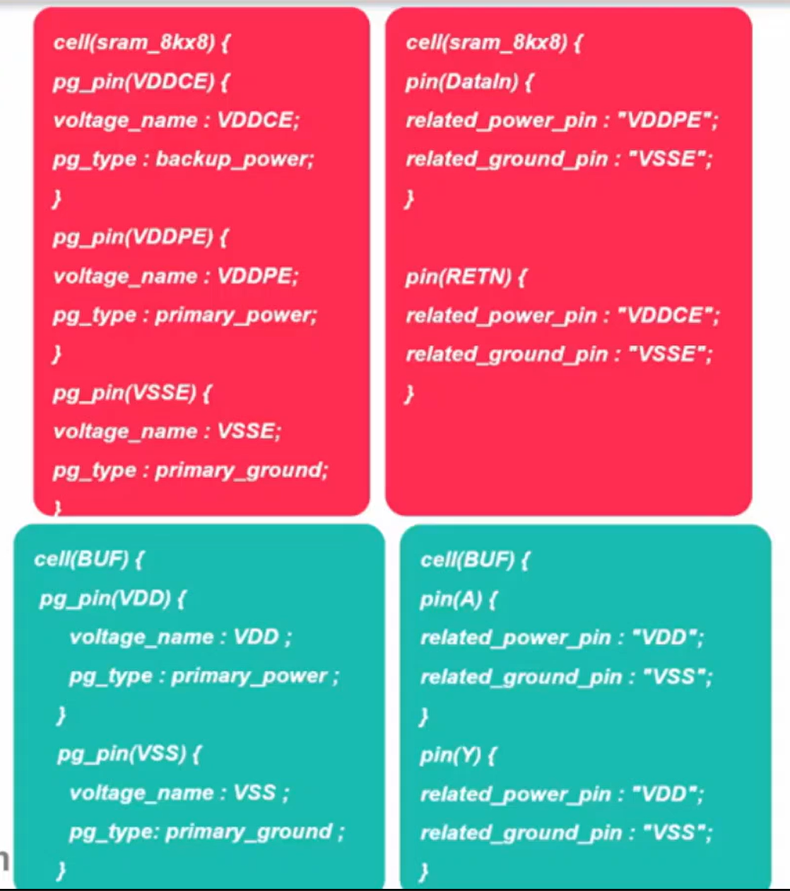
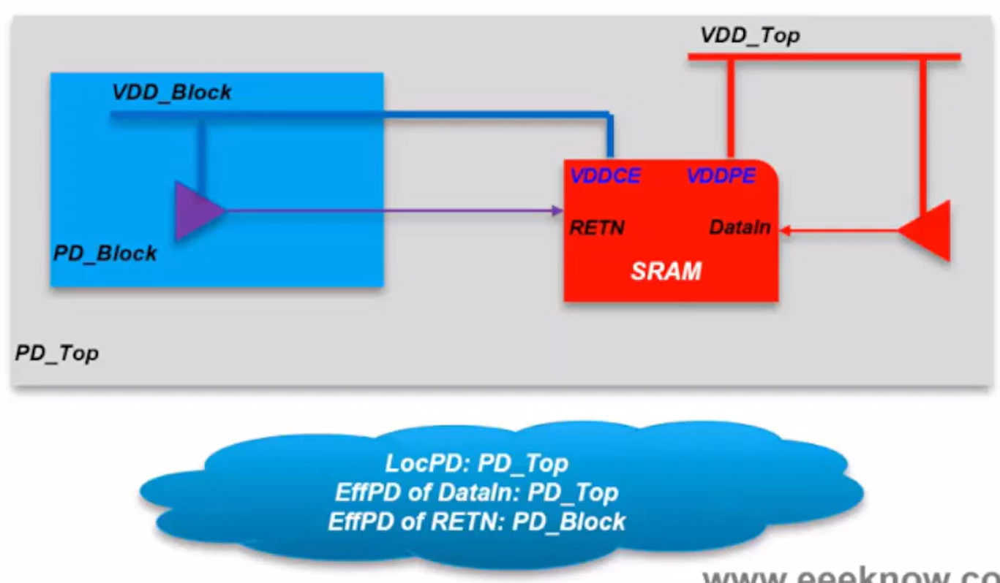
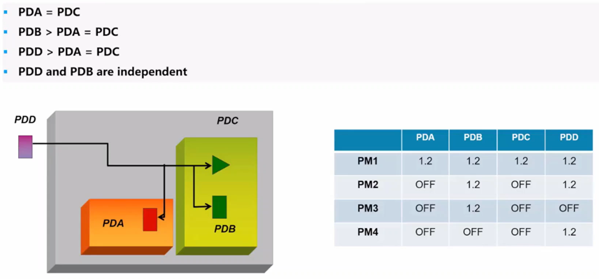
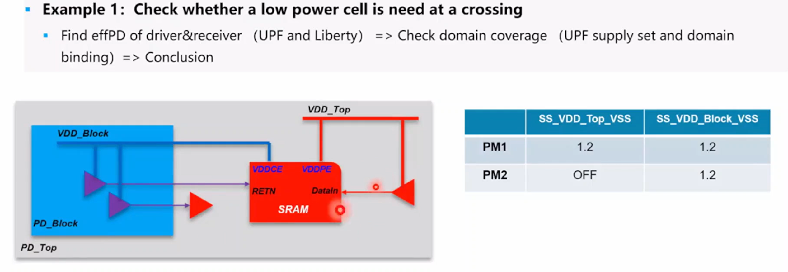
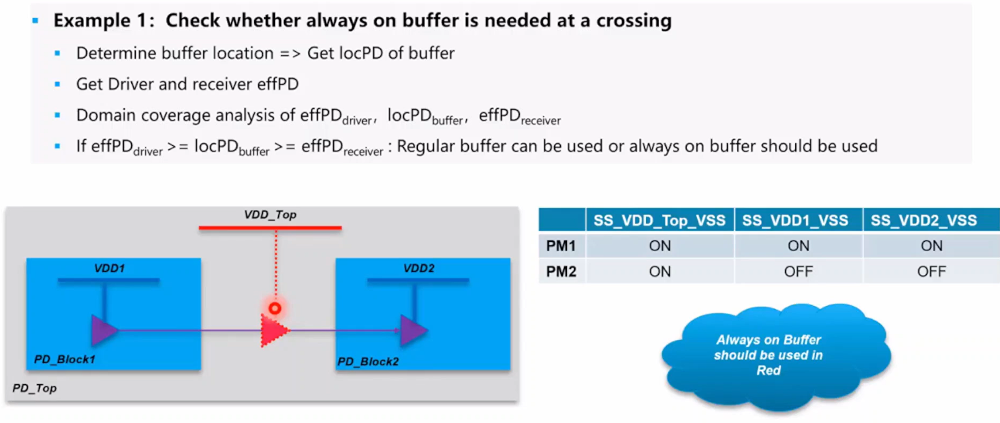

## Location PD 与 Effective PD

定义：
- Location PD：实例所属的电压域
- Effective PD：给实例signal pin和boundary port供电的电压域

### 如何推出来location PD和effective PD

- location PD：数字版图中实例布局的位置
- effective PD：
    - instance term：从liberty和UPF GNC
    - Design boundry ports：Derive from UPF setting
        - UPF2.0中，所有boundry ports被UPF中默认定义的电压域驱动
        - UPF2.1中，所有boundry ports被未知电压域驱动
        - 使用以下命令定义UPF中boundary ports的effPD
            - `set_port_attributes -ports -driver_supply -receiver_supply`是一个UPF命令，用于为电源域端口分配特定的功率相关信息，如钳位电平、驱动电源和接收电源
                - ports port_list：指定要设置属性的端口列表，可以使用通配符或正则表达式。
                - driver_supply supply_net：指定端口的驱动电源电网，用于为端口提供输出电压。
                - receiver_supply supply_net：指定端口的接收电源电网，用于为端口提供输入电压。
                - clamp_value {0 | 1 | Z | X}：指定端口的钳位电平，用于在端口所属的电源域关闭时控制端口的输出值。

    
     
    

        Liberty
  	

    
     
    

        location PD & effective PD derivation
  	

- 实例信号引脚 effPD 确定流程

    - 从实例库中找到 related_power_pin/related_ground_pin
    - 从 UPF 中找到连接到 related_power_pin/related_ground_pin 的supply set
    - 找到绑定supply set的power domain

对于标准单元instance，输入输出信号的effPD都是等于location PD的。

## Domain Coverage

### Domain Coverage Relationship

- Cover：如果PD1到PD2之间不需要插入任何低功耗单元，则PD1 cover PD2 (PD1 >= PD2)
    - PD1 off >= PD2 off (PD1关断时，PD2也关断)
    - PD2 on >= PD1 on (PD2开启时，PD1也开启)
    - VDD1(t) >= VDD2(t) (PD1的电压高于PD2，否则需要插入level shifter)
    - VSS1(t) <= VSS2(t)

- Equivalent：如果PD1 cover PD2 并且 PD2 cover PD1，则PD1和PD2是等效的
    - PD1 到 PD2 之间不需要插入任何低功耗单元，反之亦然
    - PD1 到 PD2 可以用regular buffer，反之亦然
    - 如果必要可以使用来自等效电源域的power net，比如feedthrough

- Independent：如果PD1和PD2互相不cover
    - PD1 和 PD2 之间需要插入低功耗单元

### Domain Coverage Example

    
     
    

        Domain Coverage Example
  	

- PDA = PDC
- PDB > PDA = PDC
- PDD > PDA = PDC
- PDD and PDB are independent

## Domain Based Solution

    
     
    

        Domain Based Solution Example 1
  	

- PD_Top的primary supply set是SS_VDD_Top_VSS，PD_Block的primary supply set是SS_VDD_Block_VSS，其中PM2下PD_Top是shut off的，PD_Block是cover PD_Top的

    
     
    

        Domain Based Solution Example 2
  	

- PD_Top是cover PD_Block1和PD_Block2
- Buffer的location PD是PD_Top
- Driver的effective PD是PD_Block1，Receiver的effective PD是PD_Block2
- Domain Coverage Analysis
- 如果 Driver的$effPD_{driver} >= locPD_{buffer} >= effPD_{receiver}$，则可以使用Regular Buffer，否则需要使用Always on buffer，因此图中需要使用Always on buffer