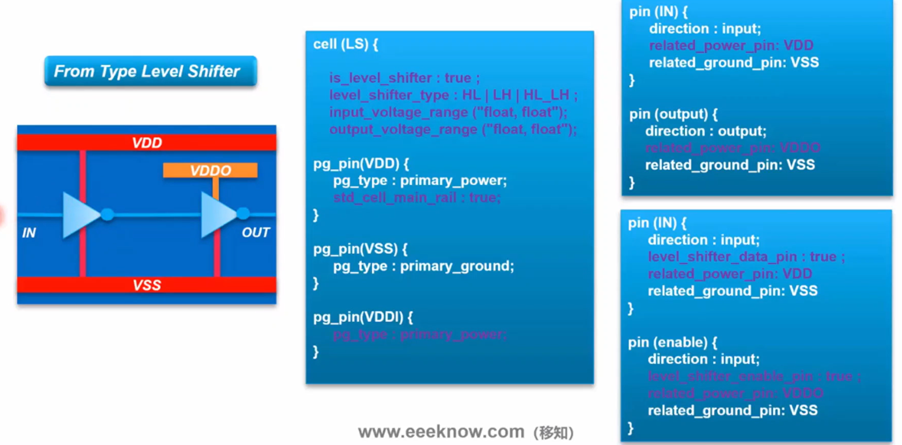

## 常用低功耗单元

- isolation cell：隔离单元
    - 用于关断电源域到常开电源域的接口
- level shifter：电平转换器
    - 用于拥有不同电压的电源域的接口
- power switch：电源开关
    - 用于关断电源域打开和关闭电源
- state retention cell：状态保持单元
    - 用于在可关断电源域关闭时保存关键bit信号
- always on cell：常开单元
    - 用于缓冲关断电源域中常开的网络或跨不同电源域的网络
    - always on buffer/inverter

## isolation cell

isolation cell可分为to type和from type两种
- to type放在always on电源域
- from type放在shut off电源域

    
     
    

        to type isolation cell
  	

这是一个and type的isolation cell，当enable信号为1时，为isolate状态，enable信号为0时，为normal状态

    
     
    

        from type isolation cell
  	

这是一个from type的isolation cell，enable pin和out pin用backup power供电

## level shifter

level shifter功能：
- 防止低电压信号直接驱动高电压域的逻辑
- 防止高电压域的信号直接驱动低电压域的逻辑（不必要）

    
     
    

        level shifter
  	

level shifter的类型：

- 单元结构：
    - 通常一个输入，一个输出，功能相当于一个buffer

- 按照功能分类：
    - buffer type
    - AND/OR type：拥有enable信号的level shifter，function = level shifter + isolation

- 按照输入到输出电压范围：
    - LH：低到高
    - HL：高到低
    - LH_HL：双向

- 按照location分类：
    - from type：驱动Power domain中使用，通常两个电源管脚
    - to type：接收Power domain中使用，HL类型：1个power pin，LH类型以及双向：2个power pin
    - any location：能够在任何power domain中使用，通常有三个power pin

    
     
    

        to type level shifter
  	

    
     
    

        from type level shifter
  	

## power switch

power switch功能：

- 在关闭电源域内或周围添加单元以控制域电源

power switch类型：

- Coarse Grain：一个power switch cell控制一片逻辑单元的电源关断和打开
    - Power shut off：header switch，简单建模成PMOS连接到电源网络，最多被使用到
    - Ground shut off：footer switch，简单建模成NMOS连接到地网络，因为电子的迁移率高于空穴
- Fine Grain：将power switch嵌入到cell中，通常使用在macro cell
    - 精确控制，但面积开销大

    
     
    

        power switch
  	

header cell类型：

- Cell structure：
    - 无使能输出，一个使能输入
    - 一个使能输入，一个使能输出
    - 两个使能输入，两个使能输出
- switch pattern：
    - Ring Type：围绕关断电压域或者macro cell
    - Column Type：关断电压域内

    
     
    

        power switch type: ring type/column type
  	

- 大多数shut off design都用的是column type，用ring type会导致block中心位置的电压降比较大
- ring type 比较多用于macro cell的电源管理

    
     
    

        power switch type: 1 enable/1 enable in 1 enable out/2 enable in 2 enable out
  	

- 1 enable
    - 使用的不是很多，所有power switch的enable端接到一个net上是multi fanout，有drv风险，需要用always on buffer做成buffer tree，开销大；
- 1 enable in 1 enable out
    - 内置了一个buffer，buffer电源连在always on电源上
    - 形成chain的结构
- 2 enable in 2 enable out
    - 两个PMOS和两个buffer，PMOS的size不一样
    - 它可以通过延迟或分阶段地开启或关闭Power Switch，减少rush current和IR drop
    - 先开启较小的PMOS，再开启较大的PMOS

    
     
    

        power switch library
  	

## always on cell

常见需要always-on buffer的情况：

- 一个信号需要穿过一个可关断电源域，需要增加always-on cell
- 仅有一条准则：新加入的buffer不能引入任何低功耗违例（缺少isolation或者shifter）

    
     
    

        always on cell
  	

