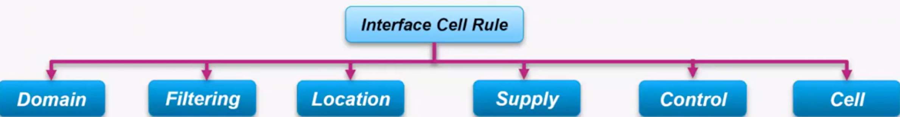
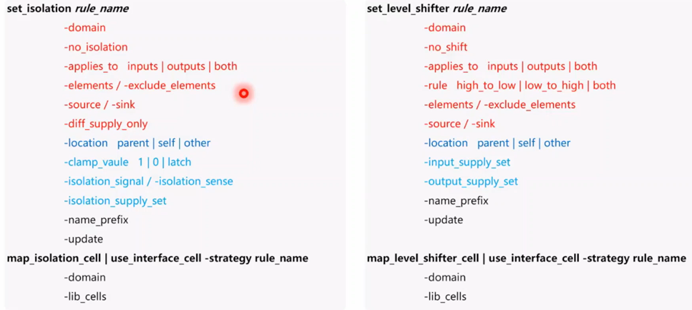

## Isolation & Shifter Rules

### 概述

- domain声明：所有rule必须指定在domain上
- 过滤规则：哪些ports？所有outputs？
- logic location：相对于domain来说的，domain parent or self
- cell power/ground supply
- 控制信号连接（仅isolation和enable shifter）
- cell type：（different command with above）

<center>
    
    <br>
    <div style="color:orange; border-bottom: 1px solid #d9d9d9;
    display: inline-block;
    color: #999;
    padding: 2px;">
        interface cell rule
  	</div>
</center>

### isolation/level shifter常用的option

<center>
    
    <br>
    <div style="color:orange; border-bottom: 1px solid #d9d9d9;
    display: inline-block;
    color: #999;
    padding: 2px;">
        interface cell rule
  	</div>
</center>

#### isolation rule

```tcl
set_isolation strategy_name
    -domain domain_name
    [-elements element_list]
    [-exclude_elements exclude_list]
    [-source <source_domain_name | source_supply_ref >]
    [-sink <sink_domain_name | sink_supply_ref >]
    [-diff_supply_only [<TRUE | FALSE>]]
    [-use_equivalence [<TRUE | FALSE>]]
    [-applies_to <inputs | outputs | both>]
    [-applies_to_boundary <lower | upper | both>]
    [-applies_to_clamp <0 | 1 | any | Z | latch | value>]
    [-applies_to_sink_off_clamp <0 | 1 | any | Z | latch | value>]
    [-applies_to_source_off_clamp <0 | 1 | any | Z | latch | value>]
    [-no_isolation]
    [-force_isolation]
    [-location <self | other | parent | fanout>]
    [-clamp_value <0 | 1 | Z | latch | value | {<0 | 1 | Z | latch | value>*}>]
    [-isolation_signal signal_list [-isolation_sense <high | low | {<high | low>*}>]]
    [-isolation_supply supply_set_list]
    [-name_prefix pattern] [-name_suffix pattern]
    [-instance {instance_name port_name}* ]
    [-update]
```

#### level shifter rule

```tcl
set_level_shifter strategy_name
    -domain domain_name
    [-elements element_list]
    [-exclude_elements exclude_list]
    [-source <source_domain_name | source_supply_ref>]
    [-sink <sink_domain_name | sink_supply_ref>]
    [-use_equivalence [<TRUE | FALSE>]]
    [-applies_to <inputs | outputs | both>]
    [-applies_to_boundary <lower | upper | both>]
    [-rule <low_to_high | high_to_low | both>]
    [-threshold <value>]
    [-no_shift] [-force_shift]
    [-location <self | other | parent | fanout>]
    [-input_supply supply_set_ref] [-output_supply supply_set_ref]
    [-internal_supply supply_set_ref]
    [-name_prefix pattern] [-name_suffix pattern]
    [-instance {instance_name port_name}* ]
    [-update]
```

## Retention Rule


## Power Switch Rule