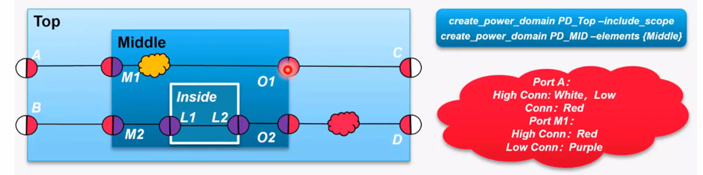

## Isolation & Shifter Rules

### 概述

- domain声明：所有rule必须指定在domain上
- 过滤规则：哪些ports？所有outputs？
- logic location：相对于domain来说的，domain parent or self
- cell power/ground supply
- 控制信号连接（仅isolation和enable shifter）
- cell type：（different command with above）

<center>
    
    <br>
    <div style="color:orange; border-bottom: 1px solid #d9d9d9;
    display: inline-block;
    color: #999;
    padding: 2px;">
        interface cell rule
  	</div>
</center>

### isolation/level shifter常用的option

<center>
    
    <br>
    <div style="color:orange; border-bottom: 1px solid #d9d9d9;
    display: inline-block;
    color: #999;
    padding: 2px;">
        interface cell rule
  	</div>
</center>

#### isolation rule

```tcl
set_isolation strategy_name
    -domain domain_name
    [-elements element_list]
    [-exclude_elements exclude_list]
    [-source <source_domain_name | source_supply_ref >]
    [-sink <sink_domain_name | sink_supply_ref >]
    [-diff_supply_only [<TRUE | FALSE>]]
    [-use_equivalence [<TRUE | FALSE>]]
    [-applies_to <inputs | outputs | both>]
    [-applies_to_boundary <lower | upper | both>]
    [-applies_to_clamp <0 | 1 | any | Z | latch | value>]
    [-applies_to_sink_off_clamp <0 | 1 | any | Z | latch | value>]
    [-applies_to_source_off_clamp <0 | 1 | any | Z | latch | value>]
    [-no_isolation]
    [-force_isolation]
    [-location <self | other | parent | fanout>]
    [-clamp_value <0 | 1 | Z | latch | value | {<0 | 1 | Z | latch | value>*}>]
    [-isolation_signal signal_list [-isolation_sense <high | low | {<high | low>*}>]]
    [-isolation_supply supply_set_list]
    [-name_prefix pattern] [-name_suffix pattern]
    [-instance {instance_name port_name}* ]
    [-update]
```
- strategy_name： isolation策略的名字。
- domain：定义该策略的电源域。
- elements：该策略潜在应用的实例和端口列表。
- exclude_elements：该策略不应用的实例和端口列表。
- source：supply set或者domain name的名字。当使用一个电源域名，它表示这个电源域的主电源。
- sink：supply set或者domain name的名字。当使用一个电源域名，它表示这个电源域的主电源。
- diff_supply_only：指示是否应隔离连接到相同电源的其他端口的端口。如果未指定该选项，默认值为 -diff_supply_only TRUE；如果指定了 -diff_supply_only 但未提供值，则默认值为 TRUE。
- use_equivalence：指示是否考虑电源组等效性。如果未指定 -use_equivalence，默认值为 -use_equivalence TRUE；如果指定了 -use_equivalence 但未提供值，则默认值为 TRUE。
- applies_to：一个限制策略仅适用于特定方向端口的过滤器。
- applies_to_boundary：限制过滤器的应用于指定的边界。默认值为 both。
- applies_to_clamp：一个限制策略仅适用于具有特定钳位值要求的端口的过滤器。
- applies_to_sink_off_clamp：一个限制策略仅适用于具有特定下游关闭钳位值要求的端口的过滤器。
- applies_to_source_off_clamp：一个限制策略仅适用于具有特定上游关闭钳位值要求的端口的过滤器。
- no_isolation：指示隔离单元不插入刀指定端口。
- force_isolation：禁用涉及隔离单元的任何实现优化；用于强制冗余隔离或保持已为其定义隔离策略的浮动/常量端口。
- location：推断出的隔离单元在逻辑层次结构中放置的位置，这决定了它们应插入的电源域。默认值为 self。
- clamp_value：隔离单元能够驱动的值。
- isolation_signal：隔离单元的控制信号。
- isolation_sense：隔离单元的隔离控制信号的有效电平。默认值为高。
- isolation_supply：给隔离单元供电的supply set。
- name_prefix/suffix：生成的隔离实例或与隔离策略实现相关的网络的名称格式（前缀和后缀）。
- instance：技术叶单元实例的名称以及它所隔离的逻辑端口的名称。
- update：这条命令表示为之前在相同策略名称（strategy_name）和电源域名称（domain_name）下执行的命令提供附加信息，并且在相同范围内执行。

```tcl
map_isolation_cell isolation_strategy
    -domain power_domain
    -lib_cells lib_cells
```

- isolation_strategy：指定UPF隔离策略的名称。隔离策略的名称在指定的电源域内必须是唯一的。
- power_domain：指定此隔离策略所属的电源域名称。
- lib_cells：指定用于隔离映射的目标库单元列表。

#### level shifter rule

```tcl
set_level_shifter strategy_name
    -domain domain_name
    [-elements element_list]
    [-exclude_elements exclude_list]
    [-source <source_domain_name | source_supply_ref>]
    [-sink <sink_domain_name | sink_supply_ref>]
    [-use_equivalence [<TRUE | FALSE>]]
    [-applies_to <inputs | outputs | both>]
    [-applies_to_boundary <lower | upper | both>]
    [-rule <low_to_high | high_to_low | both>]
    [-threshold <value>]
    [-no_shift] [-force_shift]
    [-location <self | other | parent | fanout>]
    [-input_supply supply_set_ref] [-output_supply supply_set_ref]
    [-internal_supply supply_set_ref]
    [-name_prefix pattern] [-name_suffix pattern]
    [-instance {instance_name port_name}* ]
    [-update]
```

```tcl
map_level_shifter_cell level_shifter_strategy
    -domain power_domain
    -lib_cells lib_cells
```

### Isolation & Shifter Rule——Half Ports

- High Connection & Low Connection of hierarchical pin
    - 设计中每一层次pin都被分为两部分（half ports）
    - High Conn：设计层次结构中端口连接的较高一侧；与正式端口定义相关的实际信号。
    - Low Conn：设计层次结构中端口连接的较低一侧；正式端口定义。

<center>
    
    <br>
    <div style="color:orange; border-bottom: 1px solid #d9d9d9;
    display: inline-block;
    color: #999;
    padding: 2px;">
        half ports example
  	</div>
</center>

### Isolation & Shifter Rule——Interface

- Domain Interface
    - 只要半端口位于不同的电源域中，就存在电源域接口
    - cadence CPF flow中的重要规则：**任何isolation和level shifter应用在domain interface上**
- Isolation & shifter rule在相同port的不同half port上指定

<center>
    
    <br>
    <div style="color:orange; border-bottom: 1px solid #d9d9d9;
    display: inline-block;
    color: #999;
    padding: 2px;">
        half ports example
  	</div>
</center>

### Isolation & Shifter Rule——Version

<center>
    
    <br>
    <div style="color:orange; border-bottom: 1px solid #d9d9d9;
    display: inline-block;
    color: #999;
    padding: 2px;">
        isolation and shifter rule version change
  	</div>
</center>

- UPF 2.1中Macro的port也可以被定义为half port

### Isolation & Shifter Rule——Filter

- 基于port的规则过滤方法学
    - 越具体的rule优先级越高
    - 优先级取决于最高优先级的feature
    - UPF 2.0 与 2.1的区别在于哪个feature被认为更加具体

<center>
    
    <br>
    <div style="color:orange; border-bottom: 1px solid #d9d9d9;
    display: inline-block;
    color: #999;
    padding: 2px;">
        isolation and shifter rule filter
  	</div>
</center>

- 对于multi-bit的信号（比如bus），部分bit的优先级高于整个bus所有bit的优先级
- applies to inputs/outputs 高于 applies to both

<center>
    
    <br>
    <div style="color:orange; border-bottom: 1px solid #d9d9d9;
    display: inline-block;
    color: #999;
    padding: 2px;">
        isolation and shifter rule filter example
  	</div>
</center>

- 基于电源的规则过滤方法学
    - diff_supply_only：仅使用isolation，如果driver和receiver的supply set不同，才会隔离
    - rule high_to_low/low_to_high：仅使用level shifter，如果电压范围符合特定方向，才会进行电压转换
    - sink：如果receiver有特定的supply set，才会隔离
    - source：如果driver有特定的supply set，才会隔离

<center>
    
    <br>
    <div style="color:orange; border-bottom: 1px solid #d9d9d9;
    display: inline-block;
    color: #999;
    padding: 2px;">
        supply based rule filter example
  	</div>
</center>

### isolation & shifter rule——Location

- IEEE 2009 支持指定8种isolation & shifter rule location
    - <parent | self | other | fanin | fanout | faninout | silbling | automatic>
- 推荐并且最常用的
    - <parent | self | other>
- location 定义了 isolation & shifter 应当放置 port的哪一侧
    - Self: 将单元放置在与-domain选项指定的相同域中
    - Parent: 将隔离放置在端口的更高层次的层级中
    - Other: 将单元放置在另一个域中，即未由-domain选项指定的域中

<center>
    
    <br>
    <div style="color:orange; border-bottom: 1px solid #d9d9d9;
    display: inline-block;
    color: #999;
    padding: 2px;">
        location example
  	</div>
</center>

### isolation & shifter rule——example

<center>
    
    <br>
    <div style="color:orange; border-bottom: 1px solid #d9d9d9;
    display: inline-block;
    color: #999;
    padding: 2px;">
        isolation and shifter rule example
  	</div>
</center>

## Retention Rule

```tcl
set_retention retention_strategy_name
    -domain power_domain
    [-retention_power_net retention_power_net]
    [-retention_ground_net retention_ground_net]
    [-retention_supply retention_supply_set]
    [-no_retention]
    [-elements objects]
    [-exclude_elements objects]
    [-save_condition boolean_function]
    [-restore_condition boolean_function]
    [-retention_condition boolean_function]
    [-use_retention_as_primary]
    [-update]
```

```tcl
map_retention_cell retention_strategy_name
    -domain power_domain
    [-lib_cells lib_cells]
    [-lib_cell_type lib_cell_type]
    [-lib_model_name model_name {-port port_name net_ref}*]
    [-elements objects]
```


## Power Switch Rule