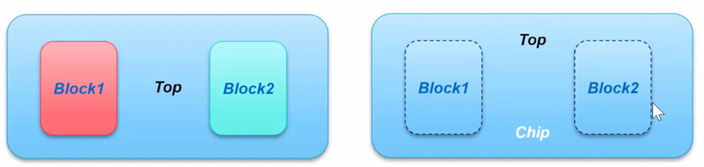

## 层次化UPF编码思路

### Design Hierarchy

- Block level：模块级别，如CPU/GPU等等
- Top level：芯片去掉Block以外的部分，block被当作Black Box/Interface Logic Model
- Chip level：整个芯片完全flatten的层次

<center>
    
    <br>
    <div style="color:orange; border-bottom: 1px solid #d9d9d9;
    display: inline-block;
    color: #999;
    padding: 2px;">
    Design Hierarchy
  	</div>
</center>

- Block UPF：描述block低功耗信息的完整UPF
    - block使用的电源，以及电源与block的连接
    - block使用的低功耗单元rule
    - power state与chip level兼容

- Top UPF：完整描述芯片的UPF
    - Top only objects的低功耗信息
    - top与block的PG/signal连接
    - Block domain声明，低功耗单元rule（看具体设计）
- Chip UPF：
    - Top & Block UPF的组合
    - 移除重复的定义

### Block UPF

- 层次化UPF中的Block UPF编码
    - Power State：必须与Top UPF兼容
    - 只能包含该block内使用的supply set
    - 定义边界端口的低功耗属性

<center>
    
    <br>
    <div style="color:orange; border-bottom: 1px solid #d9d9d9;
    display: inline-block;
    color: #999;
    padding: 2px;">
    Block UPF example 1
  	</div>
</center>

```tcl
# inside level shifter
create_supply_net VDD_Top
set_port_attributes -ports -driver_supply SS_VDD_TOP
set_level_shifter

# outside level shifter
set_port_attributes -ports -driver_supply SS_VDD_Block
```

```tcl
# Block UPF:
# (1) Inside ISO & PSW:
create_supply_net VDD_Top

set port_attributes -ports -receiver_supply SS_VDD_TOP
create_power_switch ...
set isolation ...
# (2) Outside ISO & PSW.
set port_attributes -ports -receiver_supply SS_VDD Block
# (3) Inside PSW & Outside 1SO
create_supply_net VDD_Top
set_port_attributes -ports -receiver_supply SS_VDD Block
create_power_switch ...
```

