## 1. 低功耗设计策略

功耗正日益成为电路设计的一个重要方面。本章将在以下章节介绍降低功耗的策略：

* [1.1 日益严峻的功耗挑战](#1.1)

* [1.2 动态和静态功耗](#1.2)

* [1.3 降低功耗的方法](#1.3)

* [1.4 IEEE 1801 Standard (UPF)](#1.4)

<h3 id="1.1">1.1 日益严峻的功耗挑战</h3>

CMOS 器件的器件密度和时钟频率大幅提高，从而增加了功耗。同时，电源电压和晶体管阈值电压降低，导致漏电流显著增加。

高功耗会导致运行过程中温度过高，由于电迁移和其他与热有关的故障机制而降低可靠性。高功耗还会缩短便携式设备的电池寿命。

数以百万计的计算机、服务器和其他设备都需要消耗能源，既要保证设备运行，又要冷却使用这些设备的机器和建筑物。哪怕只是降低一小部分功耗，也能为用户节省大量总成本，并为环境带来显著效益。

<h3 id="1.2">1.2 动态和静态功耗</h3>

设计人员会考虑两种类型的功耗，即动态功耗和静态功耗。动态功耗是在晶体管开关过程中消耗的，因此取决于时钟频率和开关活动。静态功耗是晶体管漏电流，只要向器件供电就会产生，因此与开关活动无关。

最先进的综合和物理实现工具会考虑总功耗（动态和静态泄漏功耗之和）以及物理位置优化。总功耗优化可缩短关键线网和单元大小，从而在允许的时序裕度范围内优化功耗。

<h4 id="1.2.1">1.2.1 动态功耗</h4>

动态功耗是在网络上的逻辑状态转换期间所消耗的能量，它由切换功耗和内部功耗组成。切换功耗来源于通过单元输出对外部容性负载的充放电过程。内部功耗则是由于在状态转换期间，PMOS和NMOS晶体管堆叠中流过的短路（或称为“crowbar”）电流所造成的。

图1展示了切换功耗的情况。当反相器的输出从0变为1时，通过PMOS晶体管对容性负载进行充电。而当输出从1变为0时，则通过NMOS晶体管对同一容性负载进行放电。

    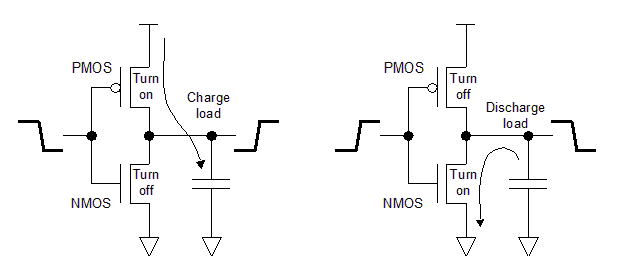
     
    

      图1 切换功耗
  	

每次切换所消耗的能量取决于电源电压和电容负载。此外，由于电流仅在逻辑转换期间流动，因此长期动态功耗取决于时钟频率和开关活动。

当输入处于中间电压电平时，当 PMOS 和 NMOS 晶体管都导通时，会产生内部功耗。这种情况会导致从 VSS 到地的导电路径几乎短路，如图 2 所示。相对较大的电流（称为短路电流）短暂流过晶体管。较高的阈值电压和较慢的转换时间会导致更多的内部功耗。

    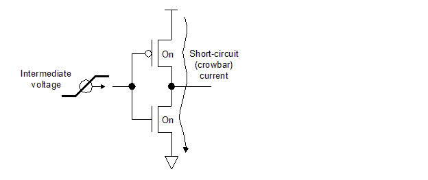
     
    

      图2 内部功耗
  	

<h4 id="1.2.2">1.2.2 静态功耗</h4>

随着器件几何尺寸的缩小和阈值电压的降低，漏电功耗变得越来越重要。亚阈值漏电、反向偏置​​ p-n 结二极管漏电和栅极漏电都会影响总漏电，如图 3 所示。

    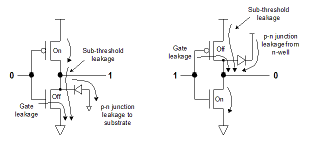
     
    

      图3 静态漏电流
  	

亚阈值漏电流是即使晶体管处于“关闭”状态时也会流过的较小源极-漏极电流。在较低的电源电压和较低的阈值电压下，“关闭”栅极电压接近“开启”阈值电压。随着栅极电压接近阈值电压，亚阈值漏电流呈指数增加。

反向偏置 p-n 结的漏电（二极管泄漏）发生在 NMOS 晶体管的 n 型漏极到接地的 p 型衬底之间，以及从 n 阱（保持在 VDD）到 PMOS 晶体管的 p 型漏极之间。这种漏电相对较小。

栅极泄漏是由于在 MOS 晶体管的栅极和沟道之间使用了极薄的绝缘层。电子可能通过栅极氧化物发生量子效应隧穿，从而导致从栅极到源极或漏极的漏电。

无论时钟频率或开关活动如何，只要向晶体管施加电源，就会发生漏电流，但可以通过降低电源电压或关闭电源来减少或消除漏电流。

<h3 id="1.3">1.3 降低功耗的方法</h3>

有几种不同的 RTL 和门级设计策略可用于降低功耗。一些方法（例如时钟门控）已广泛使用多年并取得成功。其他方法（例如动态电压和频率缩放）由于实施难度较大而未得到广泛使用。随着功耗变得越来越重要，人们正在利用更多方法。

<h4 id="1.3.1">1.3.1 降低电源电压</h4>

降低功耗的最基本方法是降低电源电压。无论是动态功耗还是静态功耗，功耗都与电源电压的平方成正比。CMOS 技术历代都采用越来越低的电源电压。

每次降低电源电压都会降低每个门的功耗，但也会降低开关速度。此外，必须降低晶体管阈值电压，从而导致更多噪声免疫、短路电流和亚阈值漏电问题。

<h4 id="1.3.2">1.3.2 时钟门控</h4>

时钟门控是一种动态功耗降低方法，可在非活动期间停止选定寄存器组的时钟信号。图 4 显示了时钟门控的一个简单实现。

    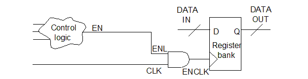
     
    

      图4 简单的时钟门控
  	

时钟门控对于需要在多个时钟周期内保持相同逻辑值的寄存器非常有用。主要挑战是找到最佳使用位置，并创建在适当时间关闭和打开时钟的逻辑。

诸如 Power Compiler 之类的综合工具可以检测时钟门控可以带来最大好处的低吞吐量数据路径，并自动在适当位置插入时钟门控单元。时钟门控相对容易实现，因为不需要额外的电源或电源基础设施更改。

图 5 显示了时序、基于锁存器的时钟门控单元的示例及其相关波形。

    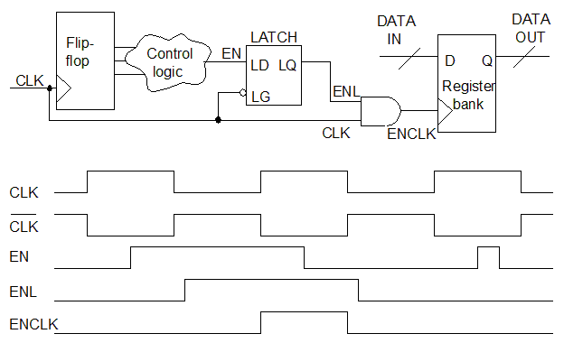
     
    

      图5 基于锁存器的时钟门控单元
  	

寄存器组的时钟输入 ENCLK 由 AND 门控制开启或关闭。ENL 是控制门控的使能信号；它来自时钟门控控制逻辑的 EN 信号。寄存器组由 ENCLK 信号的上升沿触发。时钟门控消除了在多个时钟周期内重新加载寄存器中相同值的需要，从而节省了功耗。

时钟门控通过消除反馈多路复用器环路来降低时钟网络功耗、放宽数据路径时序并减少路由拥塞。对于具有大型寄存器组的设计，时钟门控可以通过减少设计中的门数来节省功耗和面积。

另一种时钟门控技术是自门控，如图 6 所示。在此示例中，XOR 门将存储在寄存器中的数据与到达寄存器数据引脚的数据进行比较。XOR 输出控制门控的启用条件。如果数据不变，则不必要的时钟周期由 XOR 门的输出门控。

    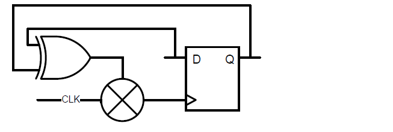
     
    

      图6 XOR 自门控单元
  	

当无法从现有逻辑推断出启用条件时，自门控非常有用。它可以应用于多个寄存器，为寄存器组创建组合启用条件。

<h4 id="1.3.3">1.3.3 多阈值库单元</h4>

一些 CMOS 技术具有多个以不同阈值电压 (Vt
值) 运行的单元，用于实现相同的逻辑功能。低 Vt 单元具有更好的速度，但亚阈值漏电流更高。

综合工具可以根据速度和功率之间的权衡选择使用适当的单元类型。它在时序关键路径中使用低 Vt 单元来提高速度，在其他地方使用高 Vt 单元来降低漏电功率。

<h4 id="1.3.4">1.3.4 多电压设计</h4>

芯片的不同部分可能有不同的速度要求。例如，CPU 和 RAM 块可能需要比外设块更快。为了在需要时获得最大速度并最大限度地降低功耗，CPU 和 RAM 可以在较高的电源电压下运行，而外设块可以在较低的电压下运行，如图 7 所示。

    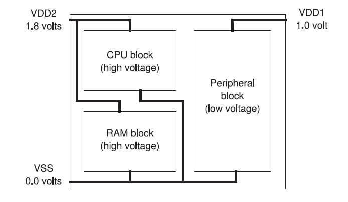
     
    

      图7 多电压芯片设计
  	

在单个芯片上提供多个电源电压会带来一些复杂性和成本。必须有额外的器件引脚来提供芯片电压，而且电源网必须将每个电压电源分别分配给相应的模块。

当逻辑信号离开一个电源域而进入另一个电源域时，如果电压相差很大，则必须使用电平转换器单元来产生具有适当电压摆幅的信号。在图 8 所示的例子中，电平转换器将 1.8 伏摆幅的信号转换为 1.0 伏摆幅的信号。电平转换器单元本身需要两个与输入和输出电源电压相匹配的电源。

    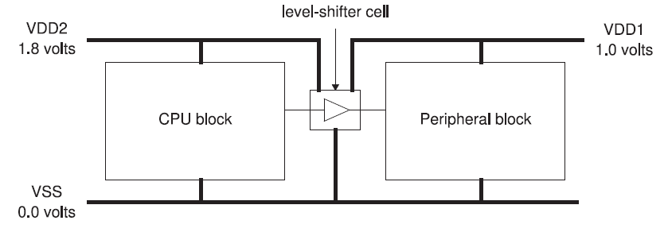
     
    

      图8 电平转换器
  	

<h4 id="1.3.5">1.3.5 电源门控</h4>

电源门控是一种省电技术，可在设备处于非活动状态时关闭部分设备。在手机芯片中，当手机处于待机模式时，可以关闭执行语音处理的模块。需要时，语音处理模块必须从断电状态 “唤醒”。

电源门控有可能大幅降低总体功耗，因为它能降低漏电功耗和切换功耗。但它也带来了一些额外的挑战：

- 电源控制器 – 确定何时关闭和打开特定模块的电源的逻辑块。关闭和打开模块的电源需要一定的时间和功耗成本，因此控制器必须确定适当的关闭时间。
- 电源门控网络 – 大量高 Vt 晶体管，具有常开的电源轨和单元电源引脚之间的源极到漏极连接。电源门控物理分布在块周围或内部。网络在打开时将电源连接到块中的逻辑门。
- 隔离单元 – 插入到设计中的单元，信号离开关闭的块并进入打开的块。当关闭的块没有电源时，隔离单元为始终开启的块提供已知的恒定逻辑值，从而防止可能导致短路电流的未知值或中间值。
- 保持寄存器 – 通过将数据保存到影子寄存器（也称为气泡寄存器）中来在关闭期间保留数据的寄存器。上电后，设备会将影子寄存器中的数据恢复到主寄存器。

<h5 id="1.3.5.1">1.3.5.1 电源门控实现</h5>

电源门控采用高 Vt 晶体管实现，因为它们可以最大限度地减少泄漏，并且速度并不重要。PMOS header开关可以放置在 VDD 和块电源引脚之间，或者 NMOS footer开关可以放置在 VSS 和块接地引脚之间，如图 9 所示。应选择开关的数量、驱动强度和位置，以便在峰值功率使用期间产生可接受的电压降。

    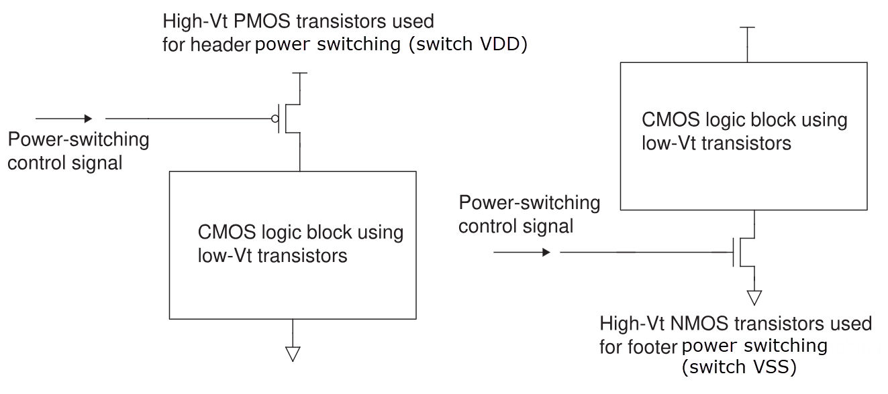
     
    

      图9 电源门控网络晶体管
  	

图 9 所示的开关策略称为粗粒度策略，因为电源门控适用于整个区块。并联的多个晶体管为整个电路块驱动一个公共电源网。在细粒度策略中，每个库单元都有自己的电源开关，可以对哪些单元断电进行细粒度控制。细粒度方法具有更好的节电潜力，但需要的面积要大得多。

电源门控可与多电压操作相结合。可以设计不同的块在不同的电压下工作，并且在不需要时分别关闭电源。在这种情况下，不同块之间的接口单元必须同时执行电平转换和隔离功能，具体取决于两个区块是在不同电压下工作，还是其中一个被关闭。同时执行这两种功能的单元称为使能电平转换器。与其他电平转换器一样，这种单元必须有两个独立的电源。

<h5 id="1.3.5.2">1.3.5.2 隔离单元实现</h5>

图 10 显示了隔离单元的一种简单实现方式。左侧区块上电时，信号 P_UP 为高电平，输出信号通过隔离单元时保持不变（门延迟除外）。当左侧区块断电时，P_UP 为低电平，进入始终保持接通区块的信号恒定为逻辑 0。其他类型的隔离单元可保持逻辑 1 而非 0，或保持掉电事件发生时锁定的信号值。在区块掉电期间，隔离单元本身必须有电源。

    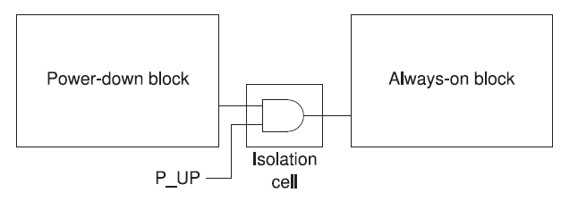
     
    

      图10 隔离单元
  	

<h5 id="1.3.5.3">1.3.5.3 保持单元实现</h5>

当区块断电后再重新上电时，通常需要将区块恢复到断电前的状态。有几种策略可以做到这一点。例如，可以在掉电前将块寄存器内容复制到块外的 RAM 中，然后在上电后再复制回来。

另一种策略是在掉电块中使用保持寄存器。图 11 显示了一种保留寄存器的实现方式。SAVE 信号在掉电前将寄存器数据保存到影子寄存器中，RESTORE 信号在上电后恢复数据。保持寄存器可以使用单个电平敏感控制信号，而不是使用单独的边沿敏感 SAVE 和 RESTORE 信号。

    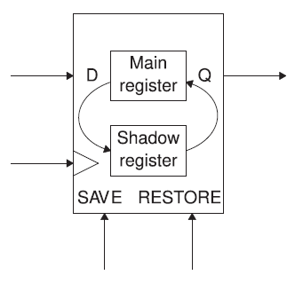
     
    

      图10 保持单元
  	

与普通寄存器相比，保持寄存器占用的面积更大，而且除了设备其他部分使用的掉电电源外，影子寄存器还需要始终接通的电源连接。不过，与其他策略相比，上电后将数据恢复到寄存器中既快又简单。

<h4 id="1.3.6">1.3.6 动态电压频率缩放</h4>

多电压操作的原理可以扩展到允许在芯片操作期间改变电压以匹配当前的工作负载。例如，在简单的电子表格计算过程中，数学处理器芯片可能会以较低的电压和时钟频率运行，然后在3D图像渲染过程中以较高的电压和频率运行。改变电源电压和工作频率以满足工作负载要求称为动态电压和频率缩放。

芯片和电压源可以设计为使用多个已建立的电平，甚至一个连续的范围。动态电压缩放需要多电平电源和逻辑块来确定用于给定任务的最佳电压电平。由于必须分析电压电平和工作频率的范围和组合，设备的设计、实现、验证和测试可能具有挑战性。

<h4 id="1.3.7">1.3.7 功耗优化的IP组件</h4>

Synopsys DesignWare®minPower组件等IP集合可用于自动实现数据通路架构，以最大限度地减少高活动数据通路并抑制毛刺。这降低了复杂组合逻辑（如乘法器和数字信号处理器中使用的逻辑）的动态和泄漏功率。

基于实际的切换活动、转换概率、可用的标准单元和对可能配置的分析，综合工具自动配置IP组件架构，以实现功耗最低的最佳结构。IP组件包括采用低功耗设计技术的块，如增强的时钟门控、内建的数据通路门控和数据跟踪流水线管理技术。

<h4 id="1.3.8">1.3.8 多bit寄存器综合和实现</h4>

综合和物理实现工具将单个寄存器位分组为多位寄存器，允许单个时钟输入驱动多个寄存器位。这减少了对缓冲器和导线等时钟树资源的需求，从而降低了功耗和面积。通过共享逻辑、电源连接和单个位的晶体管阱，多位单元本身更高效。

为了在多比特综合过程中获得最佳的节能效果，请在SAIF文件中提供准确的切换活动数据。这允许综合工具根据切换活动将比特映射到多比特寄存器中，从而使总功率最小化。

<h3 id="1.4">1.4 IEEE 1801 Standard (UPF)</h3>

IEEE 1801低功耗集成电路设计和验证标准，也称为统一电源格式（UPF），由一组用于指定多电压电子系统电源意图的命令组成。使用UPF命令，您可以为芯片设计指定电源网络、电源开关、隔离、保持和电源管理的其他方面。在整个设计、分析、验证和实现流程中使用一组低功耗设计规范命令。Synopsys工具支持UPF基础架构和命令。在多电压流程中使用UPF命令是本书的主要重点。术语“多电压”旨在包括多电源设计（具有关闭电源域的设计），即使多个域在相同电压下运行。