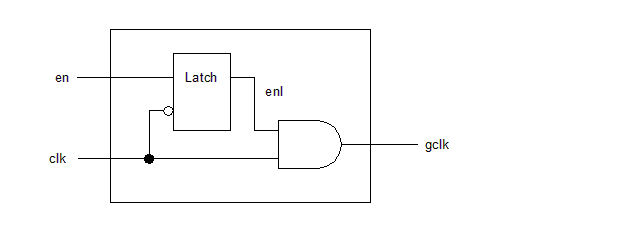
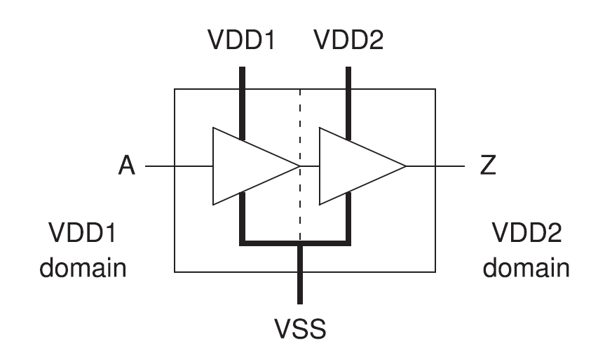
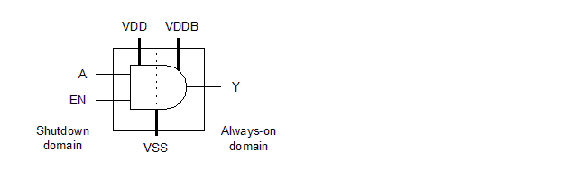
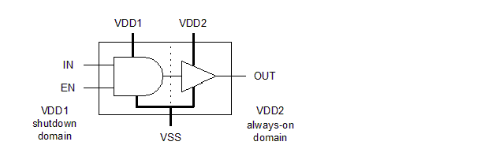
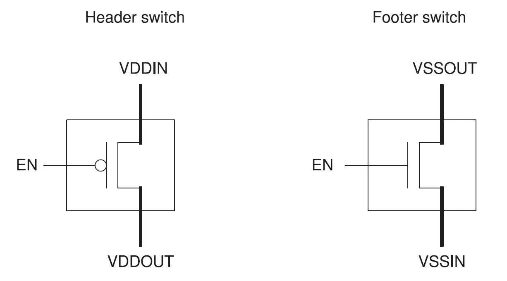
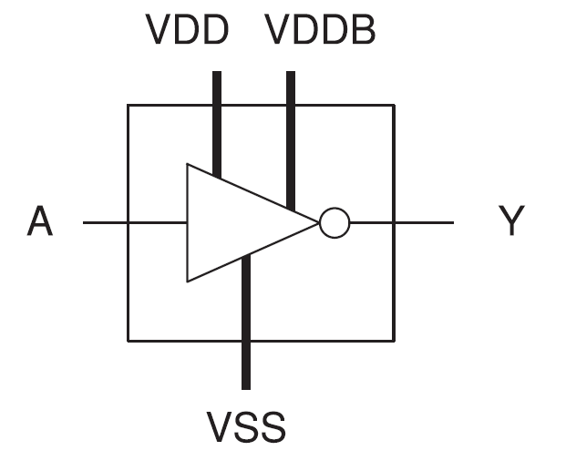
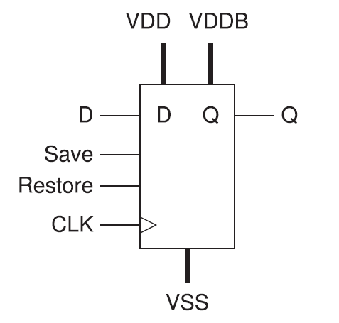

<h2 id="2.">2. 标准单元库要求</h2>

为了使用诸如时钟门控、多电压、多阈值电压 (Vt) 库单元或电源门控等节能策略，库必须包含支持这些策略的逻辑单元。以下是一些支持低电压设计的单元类型描述：

* [2.1 Liberty PG 引脚语法](#2.1)

* [2.2 时钟门控单元](#2.2)

* [2.3 多阈值电压单元](#2.3)

* [2.4 电平转换器](#2.4)

* [2.5 隔离单元](#2.5)

* [2.6 电源门控单元](#2.6)

* [2.7 常开逻辑单元](#2.7)

* [2.8 保持寄存器](#2.8)

* [2.9 具有内部生成电源的宏单元](#2.9)

* [2.10 将库转换为 PG 引脚库格式](#2.10)

<h3 id="2.1">2.1 Liberty PG 引脚语法</h3>

在早期的 CMOS 技术世代中，芯片上的所有器件始终连接到单一的全芯片电源。逻辑库中没有包含单元的电源连接信息，因为所有单元都共享相同的 VDD 和 VSS 连接。

然而，随着芯片上多电源使用的增加，有必要指定哪些电源可以连接到每个单元的特定电源引脚。对于某些类型的单元，如电平转换器，为同一个单元的不同电源引脚指定不同的电源已经成为必要。

为了适应这类信息的需求，Liberty库的语法被扩展以支持对单元电源引脚的电源轨连接的指定。这种电源和地（PG）引脚信息使得综合、实现和验证工具能够针对电源优化设计，正确地在布局中连接单元，并分析使用多种供电电压的设计行为。

有关PG引脚语法和电源引脚连接建模的更多信息，请参阅《Library Compiler™ 用户指南》中的“高级低功耗建模”部分，在Library Compiler在线文档中可以找到。

对于没有PG引脚的旧库，您可以使用Design Compiler或IC Compiler中的`add_pg_pin_to_lib`或`add_pg_pin_to_db`命令快速添加PG引脚，从而使库兼容UPF（统一电源格式）电源规范。或者，您可以使用`update_lib_model`命令使用FRAM模型更新库，或使用`update_lib_voltage_model`、`update_lib_pg_pin_model`和`update_lib_pin_model`命令来提供PG引脚信息。具体细节，请参见“将库转换为PG引脚库格式”。

<h3 id="2.2">2.2 时钟门控单元</h3>

综合工具如Power Compiler可以确定在何处可以使用时钟门控来提供最大的节能效益，并可以自动将时钟门控电路插入设计中以实现时钟门控功能。

在现有的时钟网络中插入时钟门控电路可能会引入时钟偏斜，这会对时序产生不利影响。为了让综合工具在综合过程中考虑这些影响，您可以使工具使用预定义的集成时钟门控单元，这些单元可以作为库中的逻辑单元被提供。集成时钟门控单元将时钟门控的各种组合和时序元件整合到单个库单元中。图12展示了集成时钟门控单元的一种可能实现方式。

<center>
    
    <br>
    <div style="color:orange; border-bottom: 1px solid #d9d9d9;
    display: inline-block;
    color: #999;
    padding: 2px;">
      图12 集成时钟门控单元示例
  	</div>
</center>

时钟门控单元可以集成各种逻辑，例如多个使能输入、测试时钟输入、全局扫描输入、异步复位锁存器、低电平使能逻辑或反相门控时钟输出。Power Compiler可以自由优化围绕时钟门控单元的使能逻辑，通过将周围的逻辑吸收到单元内部可用的逻辑函数中。

关于创建和使用集成时钟门控单元的更多信息，请参阅：
- 《Library Compiler™ 用户指南》中的“在Library Compiler在线文档中进行功率和电迁移建模”
- 《Power Compiler™ 用户指南》中的“时钟门控”，可在Synthesis在线帮助中找到。

<h3 id="2.3">2.3 多阈值电压单元</h3>

多阈值电压库支持每个逻辑门的两种或更多不同阈值电压组。阈值电压决定了逻辑单元的延迟和泄漏特性。具有较低阈值电压的单元可以更快地切换，但泄漏电流更大；而具有较高阈值电压的单元泄漏电流较小，但切换延迟较长。

Liberty 库语法使用 `default_threshold_voltage_group` 属性支持在同一库中使用不同阈值电压的单元。该属性定义在库级别，根据单元的电压特性指定单元所属类别的名称。该属性的语法如下：

```
default_threshold_voltage_group : “group_name”；
```
下面的示例显示了 `default_threshold_voltage_group` 属性的用法。

```
default_threshold_voltage_group : “high_vt_cell”；
```

Liberty 库语法还支持可选的单元级 `threshold_voltage_group` 属性，您可以用它将一个单元与一个或多个阈值电压类别关联起来，如下例所示：

```
cell (AND1_H) {
...
threshold_voltage_group "high_vt_cell";
...
}
cell (AND1_L) {
...
threshold_voltage_group "low_vt_cell";
...
}
```
<h4 id="2.3.1">2.3.1 使用属性定义多种阈值电压单元</h4>

如果你的目标库没有定义多种阈值电压单元及其相关属性，你可以使用工具中的`set_attribute`命令来定义多种阈值电压单元。

下面是一个Design Compiler脚本示例，展示了如何设置库级别的`default_threshold_voltage_group`属性到`high_vt_library`和`low_vt_library`库文件中，这两个库文件分别包含了高阈值电压组和低阈值电压组的单元。

```tcl
set HVT_lib "high_vt_library"
set LVT_lib "low_vt_library"
set_attribute [get_libs $HVT_lib] -type string \
    default_threshold_voltage_group HVT
set_attribute [get_libs $LVT_lib] -type string \
    default_threshold_voltage_group LVT
```

如果你在同一库文件中有多种阈值电压单元，你可以设置`default_threshold_voltage_group`和`threshold_voltage_group`属性，如下例所示：

```tcl
set all_vt_lib "multiple_vt_lib"
set_attribute [get_libs $all_vt_lib] -type string \
    default_threshold_voltage_group HVt
set_attribute [get_lib_cells ${all_vt_lib}/FAST*] -type string \
    threshold_voltage_group LVt
set_attribute [get_lib_cells ${all_vt_lib}/MEM*] -type string \
    threshold_voltage_group MD
```

要在Design Compiler或IC Compiler工具中设置多阈值电压约束，可以使用`set_multi_vth_constraint`命令，或者在IC Compiler II或Fusion Compiler工具中，可以使用`set_max_lvth_percentage`命令。具体细节，请参阅命令的手册页。

<h3 id="2.4">2.4 电平转换器</h3>

在多电压设计中，每当信号从一个电压域跨越到另一个电压域时，都需要一个电平转换器。电平转换器作为一个缓冲器工作，其输入端有一个供电电压，而输出端则是另一个不同的供电电压。因此，电平转换器将逻辑信号从一个电压摆幅转换到另一个电压摆幅，目标是尽可能减小从输入到输出的延迟。请参见图13。

<center>
    
    <br>
    <div style="color:orange; border-bottom: 1px solid #d9d9d9;
    display: inline-block;
    color: #999;
    padding: 2px;">
      图13 电平转换器
  	</div>
</center>

电平转换器单元的库描述必须包含以下信息：执行的转换类型（高电平到低电平、低电平到高电平或两者兼有）、支持的电压电平以及必须连接到每个电源的相应电源引脚的标识。

Synopsys 综合和实现工具可以识别设计中需要在驱动器和接收器之间进行调整的线网，在可用库中找到合适的电平转换器单元，将电平转换器插入网表，放置电平转换器，并布线所需的逻辑连接和各自的电源。

下面的示例显示了缓冲器型低到高电平转换器的 Liberty 语法形式。

```
cell(Buffer_Type_LH_Level_shifter) {
    is_level_shifter : true;
    level_shifter_type : LH ;
    pg_pin(VDD1) {
        voltage_name : VDD1;
        pg_type : primary_power;
        std_cell_main_rail : true;
    }
    pg_pin(VDD2) {
        voltage_name : VDD2;
        pg_type : primary_power;
    }
    pg_pin(VSS) {
        voltage_name : VSS;
        pg_type : primary_ground;
    }
    ...
    pin(A) {
        direction : input;
        related_power_pin : VDD1;
        related_ground_pin : VSS;
        input_voltage_range ( 0.7 , 0.9);
    }
    pin(Z) {
        direction : output;
        related_power_pin : VDD2;
        related_ground_pin : VSS;
        function : "A";
        power_down_function : "!VDD1 + !VDD2 + VSS";
        output_voltage_range (1.1 , 1.3);
        ...
    }
    ...
}
```

关于创建和使用电平转换器单元的更多信息，请参阅：
- 《Library Compiler™ 用户指南》中的“高级低功耗建模”，可在Library Compiler在线文档中找到。
- 《Power Compiler™ 用户指南》中的“指定电平转换器策略”，可在Synthesis在线帮助中找到。

<h3 id="2.5">2.5 隔离单元</h3>

在具有电源门控的设计中，每当逻辑信号从可关断的电压域跨越到未关断的电压域时，都需要一个隔离单元。当单元的输入侧和输出侧都被供电时，该单元作为缓冲器工作，但在输入侧断电期间提供恒定的输出信号。一个使能输入控制着单元的工作模式。请参见图14。

<center>
    
    <br>
    <div style="color:orange; border-bottom: 1px solid #d9d9d9;
    display: inline-block;
    color: #999;
    padding: 2px;">
      图14 隔离单元
  	</div>
</center>

下面的例子展示了典型隔离单元的Liberty语法形式。

```
cell(Isolation_Cell) {
    is_isolation_cell : true;
    dont_touch : true;
    dont_use : true;
    pg_pin(VDD) {
    voltage_name : VDD;
    pg_type : primary_power;
}
pg_pin(VSS) {
    voltage_name : VSS;
    pg_type : primary_ground;
}
...
pin(A) {
    direction : input;
    related_power_pin : VDD;
    related_ground_pin : VSS;
    isolation_cell_data_pin : true;
}
pin(EN) {
    direction : input;
    related_power_pin : VDD;
    related_ground_pin : VSS;
    isolation_cell_enable_pin : true;
}
pin(Y) {
    direction : output;
    related_power_pin : VDD;
    related_ground_pin : VSS;
    function : "A * EN";
    power_down_function : "!VDD + VSS";
timing() {
    related_pin : "A EN";
    cell_rise(template) {
...
}
}
...
}
...
}
```

能够同时执行电平转换和隔离功能的单元被称为使能电平转换器单元。这种类型的单元用于信号从一个电压域跨越到另一个电压域的情况，其中两个电压水平不同，且第一个电源域能够被断电。请参见图15。

<center>
    
    <br>
    <div style="color:orange; border-bottom: 1px solid #d9d9d9;
    display: inline-block;
    color: #999;
    padding: 2px;">
      图15 使能电平转换器单元
  	</div>
</center>

下面的例子展示了典型使能电平转换器的Liberty语法形式。

```
cell(Enable_Level_Shifter) {
    is_level_shifter : true;
    level_shifter_type : LH ;
    input_voltage_range(0.7,1.4);
    output_voltage_range(0.7,1.4);
pg_pin(P1) {
    voltage_name : VDD1;
    pg_type : primary_power;
    std_cell_main_rail : true;
}
pg_pin(P2) {
    voltage_name : VDD2;
    pg_type : primary_power;
}
...
pin(A) {
    direction : input;
    related_power_pin : P1;
    related_ground_pin : G1;
    level_shifter_data_pin:true;
}
pin(EN) {
    direction : input;
    related_power_pin : P1;
    related_ground_pin : G1;
    level_shifter_enable_pin:true;
}
...
}
```

关于创建和使用隔离单元和使能电平转换器单元的更多信息，请参阅：
- 《Library Compiler™ 用户指南》中的“高级低功耗建模”，可在Library Compiler在线文档中找到。
- 《Power Compiler™ 用户指南》中的“指定隔离策略”，可在Synthesis在线帮助中找到。

<h3 id="2.6">2.6 电源门控单元</h3>

在具有电源门控的设计中，需要使用header或footer类型的电源门控单元来为可关断的单元供电。header类型的电源门控将电源轨连接到关断电压域中单元的电源引脚。footer类型的电源门控将接地轨连接到关断电压域中单元的接地引脚。输入到电源门控的逻辑信号控制着开关的连接或断开状态。请参见图16。

<center>
    
    <br>
    <div style="color:orange; border-bottom: 1px solid #d9d9d9;
    display: inline-block;
    color: #999;
    padding: 2px;">
      图16 电源门控单元
  	</div>
</center>

电源门控单元的库描述指定了控制电源开关的输入信号、连接到实际电源轨的引脚以及提供虚拟（可开关）电源的引脚。电源门控单元可以选择性地具有一个输出“确认”信号，指示开关的当前状态。

下面的例子展示了典型电源门控单元的Liberty语法形式。

```
cell ( Simple_CG_Switch ) {
    ...
    switch_cell_type : coarse_grain;
    pg_pin ( VDD ) {
    pg_type : primary_power;
    direction : input;
    voltage_name : VDD;
}
pg_pin ( VVDD ) {
    pg_type : internal_power;
    voltage_name : VVDD;
    direction : output ;
    switch_function : "SLEEP" ;
    pg_function : "VDD" ;
}
pg_pin ( VSS ) {
    pg_type : primary_ground;
    direction : input;
    voltage_name : VSS;
}
...
pin ( SLEEP ) {
    switch_pin : true;
    capacitance: 1.0;
    related_power_pin : VDD;
    related_ground_pin : VSS;
}
...
}
```

关于创建电源开关单元的更多信息，请参阅《Library Compiler™ 用户指南》中的“高级低功耗建模”，可在Library Compiler在线文档中找到。

关于在物理规划中使用电源开关单元的信息，请参阅：
- 《IC Compiler™ Design Planning User Guide》，可在IC Compiler在线帮助中找到。
- 《IC Compiler™ II Design Planning User Guide》，可在IC Compiler II在线帮助中找到。
- 《Fusion Compiler™ Design Planning User Guide》，可在Fusion Compiler在线帮助中找到。


<h4 id="2.6.1">2.6.1 细粒度电源门控单元</h4>

Synopsys的综合和实现工具支持带有细粒度电源门控的宏单元，这些宏单元在库中的PG引脚定义中具有以下属性设置：

- `direction`属性设置为内部 (`internal`)。 
- `pg_type` 属性设置为 `internal_power` 或 `internal_ground`。 
- `pg_function` 属性已定义。 
- `switch_function` 属性已定义。 
- 宏单元的 `switch_cell_type` 属性设置为 `fine_grain`。 
- 控制端口的 `switch_pin` 属性设置为 `true`。

在使用宏单元的工具中，使用connect_supply_net命令连接到这些宏单元的内部PG引脚。仅连接到这些宏单元内部PG引脚的电源网络不能用于电平转换器的插入和常开（always-on）的综合，除非满足以下条件：

- 电源网络是电压域的主要电源。
- 电源网络由电压域的隔离策略指定。
- 电源网络由电压域的保持策略指定。
- 电源网络被定义或重用为电源域的域依赖电源网络。
- 电源网络使用`extra_supplies_#`关键字定义。

要指定细粒度电源门控单元的工作电压，请使用set_voltage命令。

关于定义细粒度电源门控单元的更多信息，请参阅《Library Compiler™ 用户指南》中的“高级低功耗建模”，可在Library Compiler在线文档中找到。

<h3 id="2.7">2.7 常开逻辑单元</h3>

当处理关断电压域时，可能会有一些情况，断电部分中的某些单元需要持续保持活动状态，例如用于实现保持寄存器、隔离单元、保持控制路径和隔离使能路径。例如，如果通过断电电压区域的保存信号或恢复信号需要缓冲，则必须使用始终开启的缓冲单元。这种类型的逻辑被称为常开逻辑，它是使用常开库单元构建的。与普通单元相比，功能等效的常开单元具有一个持续工作的备用电源供应，即使在断电模式下也是如此。请参见图17。

<center>
    
    <br>
    <div style="color:orange; border-bottom: 1px solid #d9d9d9;
    display: inline-block;
    color: #999;
    padding: 2px;">
      图17 常开逻辑单元
  	</div>
</center>

下面的例子展示了常开缓冲器的Liberty语法形式。

```
cell(buffer_type_AO) {
    always_on : true;
    pg_pin(VDD) {
    voltage_name : VDD;
    pg_type : primary_power;
}
pg_pin(VDDB) {
    voltage_name : VDDB;
    pg_type : backup_power;
}
pg_pin(VSS) {
    voltage_name : VSS;
    pg_type : primary_ground;
}
...
pin (A) {
    related_power_pin : VDDB;
    related_ground_pin : VSS;
}
pin (Y) {
    function : "A";
    related_power_pin : VDDB;
    related_ground_pin : VSS;
    power_down_function : "!VDDB + VSS";
}
...
```

关于创建和使用常开逻辑单元的更多信息，请参阅：
• 《Library Compiler™ User Guide》中的“高级低功耗建模”，可在Library Compiler在线文档中找到。
• 《Power Compiler™ User Guide》中的“始终开启逻辑”，可在Synthesis在线帮助中找到。

<h3 id="2.8">2.8 保持寄存器</h3>

在具有电源门控的设计中，有几种不同的方法可以在断电之前保存寄存器状态并在断电域重新上电时恢复它们。一种方法是使用保持寄存器，即可以通过低泄漏寄存器网络和始终开启的电源供应在断电期间维持其状态的寄存器。

保持寄存器的库描述指定了电源引脚和控制数据保存和恢复的输入信号。它还指定了哪些电源引脚是正常的，可以在断电时断电，以及哪些是始终开启的引脚，用于在断电期间维持数据。请参见图18。

<center>
    
    <br>
    <div style="color:orange; border-bottom: 1px solid #d9d9d9;
    display: inline-block;
    color: #999;
    padding: 2px;">
    图18 保持寄存器
  	</div>
</center>

```
cell(RETENTION_DFF) {
retention_cell:"ret_dff";
    area : 1.0;
    ...
pg_pin(VDDB) {
    voltage_name : VDDB;
    pg_type : backup_power;
}
...
pin(RETN) {
    direction : input;
    capacitance : 1.0;
    nextstate_type : data ;
    related_power_pin :VDDB;
    related_ground_pin:VSSG;
    retention_pin (save_restore, "1" );
}
pin(Q) {
    power_down_function:"!VDD+VSS";
    related_power_pin : VDD ;
    related_ground_pin : VSS;
    direction : output;
    ...
```

关于保持寄存器单元的更多信息，请参阅《Power Compiler™ User Guide》中的“指定保持策略”，可在Synthesis在线帮助中找到。

<h3 id="2.9">2.9 具有内部生成电源的宏单元</h3>


<h3 id="2.10">2.10 将库转换为 PG 引脚库格式</h3>
