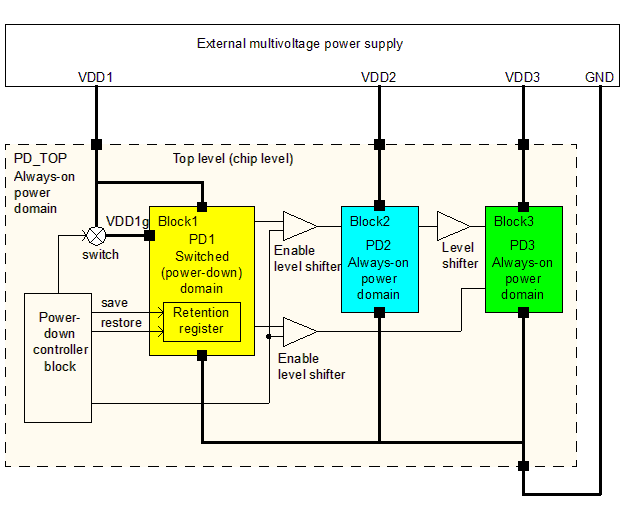
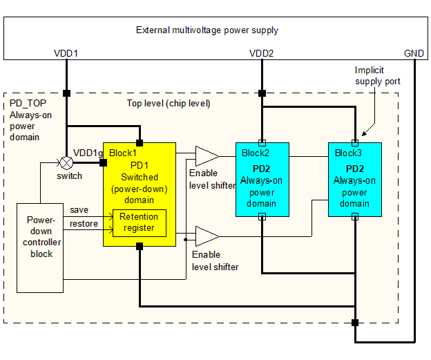
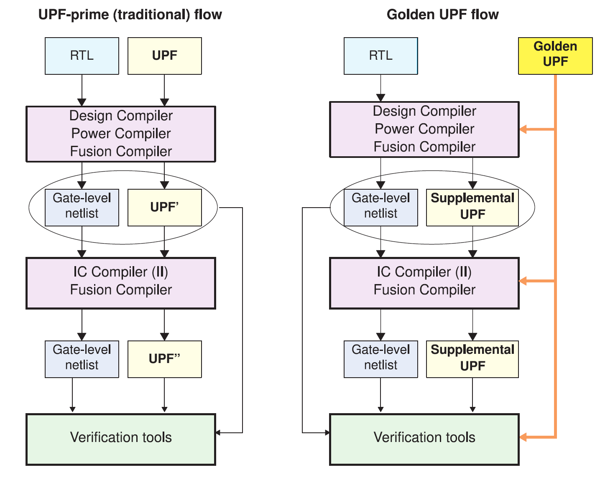

<h2 id="3.">3. 电源设计意图规范</h2>

IEEE 1801标准（也称为统一功耗格式，UPF）为低功耗集成电路的设计和验证提供了一种一致的方法，涵盖了整个设计过程，包括综合、物理实现和验证。这种一致性使得在设计中存在特定的低功耗特性时更容易进行综合、仿真、逻辑等价性检查和设计验证。

在Synopsys流程中指定设计的电源设计意图在以下章节中有描述：

* [3.1 IEEE 1801标准（UPF）](#3.1)

* [3.2 电源设计意图概念](#3.2)

* [3.3 电源网络示例](#3.3)

* [3.4 Synopsys工具支持的UPF命令](#3.4)

* [3.5 UPF命令跟踪](#3.5)

* [3.6 黄金UPF流程](#3.6)

<h3 id="3.1">3.1 IEEE 1801标准（UPF）</h3>

IEEE 1801 低功耗集成电路设计与验证标准又称统一电源格式（UPF），由一组类似 Tcl 的命令组成，用于指定多电压电子系统的设计意图。使用 UPF 命令，您可以为芯片设计指定电源网络、开关、隔离、保持以及电源管理的其他方面。在整个设计、分析、验证和实现流程中，都可以使用一套低功耗设计规范命令。

Synopsys 工具的设计遵循 IEEE 标准协会批准的 IEEE 1801 (UPF) 标准。包括 Synopsys 在内的许多 EDA 公司都支持这一标准。有关该标准的详细信息，请参见 IEEE 1801 规范本身，可从 IEEE 标准协会网站 <http://standards.ieee.org> 下载。

Synopsys 工具支持 IEEE 1801 (UPF) 标准中的大量命令子集。此外，它们还支持一些不属于该标准的类似 UPF 的电源意图命令。

<h4 id="3.1.1">3.1.1 UPF命令中的通配符模式匹配</h4>

IEEE 1801 LRM（Language Reference Manual）指出，通配符模式匹配只允许在`find_objects`和`upf_query`命令中使用。然而，Synopsys工具为许多UPF命令提供了通配符匹配功能，以提高易用性。

通配符模式匹配使用以下特殊运算符：
- `?` 匹配除层级分隔符 `/` 之外的任何单个字符。
- `*` 匹配除层级分隔符之外的任何零个或多个字符。

所有执行基于模式的对象查找的UPF命令都支持 `?` 和 `*` 通配符，并且对象查找发生在当前作用域中。表1展示了一些通配符匹配的例子。

| 模式      | 匹配         |
| --------- | ------------ |
| a         | a            |
| e*        | e12, eac, ef |
| d?f       | daf, d4f     |
| a/b\*/c\* | a/baa/c1aa   |

<h3 id="3.2">3.2 电源设计意图概念</h3>

UPF语言建立了一套命令来指定电子系统的低电源设计意图。使用UPF命令，你可以指定芯片设计的供电网络、开关、隔离、保持以及其他与电源管理相关的方面。同一套低功耗设计规范命令将在整个设计、分析、验证和实现流程中使用。Synopsys工具被设计为遵循官方的IEEE 1801 UPF标准。

UPF语言提供了一种指定设计的电源需求的方法，但并没有明确规定这些需求是如何实现的。该语言规定了如何为每个设计元素创建一个供电网络，不同电源网络之间的行为，以及如何扩展逻辑功能以支持设计元素的动态电源切换。它不包含任何布局或布线信息。

在UPF语言中，电源域是指设计中共享一组共同电源需求的元素集合。默认情况下，电源域中的所有逻辑元件使用相同的主电源和主接地。也可以为电源域定义其他电源。电源域通常在物理芯片布局中作为一个连续的电压区域来实现，但这并不是语言的要求。

每个电源域都有一个 `scope` 和 `extent`。`scope`是指被指定为该域根的逻辑层次。`extent`是指属于电源域并共享相同电压需求的一组逻辑元件。范围是在哪个层次定义电源域的层次级别，并且是属于该电源域的元件的祖先，而程度则是实际属于电源域的元件集合。

每个设计范围在其定义的层次级别上都有供电网络和供电端口。供电网络是一个导体，它在给定的电源域中传输供电电压或接地。跨越多个电源域的供电网络被称为在多个域中“重用”。供电端口是设计层次结构中两个相邻级别之间的电源连接点，即父块和子块之间的连接点。跨越设计层次结构一个级别到下一个级别的供电网络通过供电端口传输。

供电集是供电网络的抽象集合，由两个供电功能组成：电源和接地。供电集是域无关的，这意味着供电集中的电源和接地可以被创建该供电集的范围内定义的任何电源域使用。然而，每个电源域可以被限制在该电源域内使用供电集。

您可以使用供电集在RTL级别定义电源意图，因此即使在不知道实际供电网络名称之前也可以综合设计。供电集是供电网络和供电端口的抽象，设计在物理实现（布局和布线）之前，其供电集必须被细化或与实际供电网络关联。

供电集句柄是为电源域创建的抽象供电集。默认情况下，电源域具有该域的主供电集、默认隔离供电集和默认保持供电集的供电集句柄。这些供电集句柄允许您在为电源域创建任何供电集、供电网络和供电端口之前综合设计。在这样的设计可以物理实现之前，其供电集句柄必须被细化或与实际供电集关联；这些供电集必须被细化，以便它们与实际供电网络关联。

电源开关（或简称开关）是一种为供电网络开启和关闭电源的设备。开关具有一个输入供电网络、一个可以开启或关闭的输出供电网络，以及至少一个用于控制开关的输入信号。开关可以选择性地具有多个输入控制信号和一个或多个输出确认信号。电源状态表列出了设计中所有电源域的电压值和电源开关状态的允许组合。

当逻辑信号从一个电源域离开并进入另一个具有显著不同供电电压的电源域时，必须存在电平转换器。电平转换器将信号从第一个域的电压摆幅转换为第二个域的电压摆幅。

当逻辑信号离开可切换电源域并进入不同电源域时，必须存在隔离单元。电平转换器在域关闭期间生成已知的逻辑值。如果两个域的电压水平有显著差异，接口单元必须能够执行电平转换（当域通电时）和隔离（当域断电时）。能够执行这两种功能的单元称为使能电平转换器。

在具有电源切换的电源域中，任何在关闭期间必须保留数据的寄存器都必须实现为保持寄存器。保持寄存器具有一个独立的、始终开启的供电网络，有时称为备用电源，当域的主供电关闭时，它保持保持寄存器中的数据稳定。

<h3 id="3.3">3.3 电源网络示例</h3>

图21所示的电源网络示例展示了一些电源意图的概念。该芯片设计为使用三个始终开启的电源（尽管UPF语法也支持外部可切换电源），在三个不同的电平下工作。顶层芯片占据顶层电源域PD_TOP。PD_TOP域被定义为具有四个供电端口：VDD1、VDD2、VDD3和GND。电源域边界上的黑色方块代表该域的供电端口。请注意，此图显示了电源域之间的连接，并不代表芯片的物理布局。

<center>
    
    <br>
    <div style="color:orange; border-bottom: 1px solid #d9d9d9;
    display: inline-block;
    color: #999;
    padding: 2px;">
      图21 电源意图规范示例
  	</div>
</center>

除了顶层电源域PD_TOP之外，还定义了三个电源域，分别称为PD1、PD2和PD3，它们分别在三个层次块Block1、Block2和Block3的级别上创建。每个块都有供电端口（在图中显示为黑色方块），允许供电网络从顶层跨越到块级别。

在此示例中，PD_TOP、PD2和PD3是始终开启的电源域，分别在不同的供电电压VDD1、VDD2和VDD3下工作。PD1是一个具有两个电源的电源域：一个称为VDD1g的可切换电源和一个来自VDD1的始终开启电源。始终开启的电源在VDD1g断电时保持该域的保持寄存器。

电源开关通过连接或断开VDD1和VDD1g来关闭和开启电源网络VDD1g。顶层的电源关闭控制逻辑块生成开关的控制信号。它还生成域PD1中保持寄存器的保存和恢复信号，以及域PD1与始终开启域PD2和PD3之间隔离单元的控制信号。这些隔离单元在VDD1g断电期间生成已知信号。

由于PD1、PD2和PD3域在不同的供电电压下工作，因此当信号离开这些域之一并进入另一个域时，必须存在电平转换器。在信号离开PD1并进入PD2或PD3的情况下，接口单元必须能够执行电平转换和隔离功能，因为PD1可以断电。

要访问设计层次结构中的特定电源域、供电端口或供电网络，您需要指定设计中对象所在范围的层次路径，并以对象名称结束；或者您可以将工具的范围更改为该层次级别，并直接指定对象名称。例如，假设您想在Block1的范围内创建一个名为VDD1的供电网络和一个名为PRT1的供电端口，Block1位于电源域PD1中，并且您想在Block1的范围内将网络连接到端口。从顶层范围（默认范围）开始，您可以使用以下命令：

```plaintext
create_supply_net VDD1 -domain Block1/PD1
create_supply_port PRT1 -domain Block1/PD1
connect_supply_net Block1/VDD1 -ports {Block1/PRT1}
```

另一种命令输入方法是使用`set_scope`或`current_instance`命令将范围更改为Block1，并在命令中使用简单（非层次）的名称：

```plaintext
set_scope Block1
create_supply_net VDD1 -domain PD1
create_supply_port PRT1 -domain PD1
connect_supply_net VDD1 -ports {PRT1}
set_scope ...
```

在前述的电源意图策略中，每个层次块都被分配到其自己的电源域。也有可能一个层次块属于与其父级相同的电源域，或者多个层次块属于一个电源域。

在图22所示的替代电源意图规范中，Block2和Block3具有相同的电源特性，因此它们被分配到一个在层次结构顶层创建的电源域PD2。这两个块可以使用顶层定义的供电网络，因此不需要在低层块和当前层次级别之间显式创建供电端口。

<center>
    
    <br>
    <div style="color:orange; border-bottom: 1px solid #d9d9d9;
    display: inline-block;
    color: #999;
    padding: 2px;">
      图22 替代电源意图规范示例
  	</div>
</center>

电源域PD1的范围（层次级别）是Block1块，而电源域PD2的范围是顶层。Block1使用Block1范围内的供电网络，而Block2和Block3使用顶层范围内的供电网络。供电网络VDD1从设计的顶层跨越到Block1的级别，因此必须通过在Block1范围内定义的供电端口，并且该供电网络在PD1域中被重用。供电网络VDD2在顶层定义，在电源域PD_TOP中，但也在电源域PD2中使用，因此在PD2中被重用。重用的供电网络跨越不同的域，并在这些域中具有相同的名称。

要定义第一个示例（图21）中显示的电源域策略，可以使用以下命令：

```plaintext
create_power_domain PD_TOP
create_power_domain PD1 -elements {Block1} -scope Block1
create_power_domain PD2 -elements {Block2} -scope Block2
create_power_domain PD3 -elements {Block3} -scope Block3
```

要定义第二个示例（图22）中显示的电源域策略，其中Block1和Block2在同一个域中，可以使用以下命令：
```plaintext
create_power_domain PD_TOP
create_power_domain PD1 -elements {Block1} -scope Block1
create_power_domain PD2 -elements {Block2 Block3}
```
或者等效地：
```plaintext
create_power_domain PD_TOP
set_scope Block1
create_power_domain PD1
set_scope ...
create_power_domain PD2 -elements {Block2 Block3}
```

即使Block2和Block3共享相同的电源特性，您可能仍希望将它们放在单独的电源域中。这样做会使综合和实现工具分别实现对这些块的电源连接。例如，如果这些块被放置在电源关闭域中，物理实现工具可能会使用更大或更快的开关单元为消耗更大电流的块提供电源。

双向信号不能被隔离或电平转换。如果任何双向信号在电源域边界处需要隔离或电平转换，请修改设计以将这些信号分离为独立的输入信号和输出信号。

<h3 id="3.4">3.4 Synopsys工具支持的UPF命令</h3>

Synopsys工具目前支持IEEE 1801（UPF）标准中的大部分命令。此外，它们还支持一些非官方标准的类似UPF的电源意图命令。

某些UPF命令仅被部分Synopsys工具支持。例如，综合和物理实现工具会生成新的UPF命令，因此它们支持`save_upf`命令，而静态时序和验证工具不生成任何UPF命令，因此不支持`save_upf`命令。

有关以下工具支持的UPF命令的完整列表，请参阅以下SolvNetPlus文章：Design Compiler（Power Compiler）、Fusion Compiler、IC Compiler II、RTL Architect、Formality、PrimeTime、PrimePower、VCS和VC LP：

[SolvNetPlus article 024016, “Synopsys Power Management: Supported Subset of the
IEEE 1801 Unified Power Format (UPF) Standard.”](https://solvnetplus.synopsys.com/s/article/Synopsys-Power-Management-Supported-Subset-for-the-IEEE-1801-Unified-Power-Format-UPF-Standard-1576148253390)

注意： 您必须登录SolvNetPlus才能直接连接到文章。如果在点击文章链接时提示您登录SolvNetPlus，请登录，然后再次点击链接以访问文章。

<h3 id="3.5">3.5 UPF命令跟踪</h3>

综合和物理实现工具经常执行影响设计的UPF基础结构的更改，例如插入电源管理单元。这些更改会影响save_upf命令写出的UPF命令。通常希望在工具生成的新命令的上下文中查看原始命令，并由save_upf命令写出。

Design Compiler、IC Compiler、IC Compiler II和Fusion Compiler工具提供两种维护设计的UPF命令集的模式：

- UPF-prime模式：工具写出一个新的UPF文件，称为UPF-prime文件（Design Compiler）或UPF-double-prime文件（IC Compiler），其中包含旧的、修改过的和新的UPF命令的混合。
- Golden UPF模式：工具写出一个“补充”UPF文件，仅包含更改设计的UPF命令。原始的“golden”UPF文件和补充文件共同指定设计的电源基础结构。

<h4 id="3.5.1">3.5.1 Design Compiler 和 IC Compiler 中的 UPF 命令跟踪</h4>

在UPF-prime模式下，Design Compiler和IC Compiler工具读取一个UPF脚本文件，然后写出一个修改后的UPF脚本文件，其中包含原始命令以及它执行电源管理任务的新UPF命令。生成的UPF脚本可以传递给流程中的下游工具。

为了更容易比较和跟踪流程中用户编写的UPF命令，Design Compiler和IC Compiler工具将原始UPF命令与工具插入的UPF命令分开维护。用户编写的命令和工具插入的命令被写入输出UPF脚本文件的不同部分。此功能称为UPF跟踪。如果您不需要跟踪功能，并且希望工具将密切相关的命令放在文件中一起，请将`mv_upf_tracking`变量设置为false。有关更多信息，请参阅该变量的手册页。

UPF跟踪在层次化流程中不受支持。因此，如果您使用诸如`characterize`或`propagate_constraints -power_supply_data`之类的命令，`mv_upf_tracking`变量会自动设置为false，从而使密切相关的命令一起写入输出UPF文件，并混合用户编写的命令和工具插入的命令。

<h4 id="3.5.2">3.5.2 IC Compiler II 和 Fusion Compiler 中的 UPF 命令跟踪</h4>

在IC Compiler II和Fusion Compiler工具中，您在会话期间输入的UPF命令会自动存储并保存在数据库中。工具会跟踪它对您输入的UPF命令所做的任何更改。当您使用`save_upf`命令写出UPF时，工具会将您输入的每个命令作为注释行写出，紧接着是工具修改后的命令。

<h3 id="3.6">3.6 黄金UPF流程</h3>

黄金UPF流程是一种维护设计的UPF多电压电源意图的可选方法。它在综合、物理实现和验证步骤中使用原始的“黄金”UPF文件，以及由综合和物理实现工具生成的补充UPF文件。

图23比较了传统的UPF-prime流程和黄金UPF流程。

<center>
    
    <br>
    <div style="color:orange; border-bottom: 1px solid #d9d9d9;
    display: inline-block;
    color: #999;
    padding: 2px;">
      图23 UPF-prime流程和黄金UPF流程
  	</div>
</center>

黄金UPF流程在整个流程中维护和使用相同的原始“黄金”UPF文件。综合和物理实现工具将电源意图更改写入单独的“补充”UPF文件。下游工具和验证工具使用黄金UPF文件和补充UPF文件的组合，而不是单个UPF'或UPF''文件。

黄金UPF流程提供以下优点：

- 黄金UPF文件在整个流程中保持不变，保留了UPF文件的原始形式、结构、注释行和通配符命名。
- 您可以使用特定工具的条件语句在不同工具中执行不同任务。这些语句在传统的UPF-prime流程中会丢失。
- 电源意图的更改可以在补充UPF文件中轻松跟踪。
- 您可以选择使用Verilog网表存储所有PG连接信息，使得在UPF文件中不需要`connect_supply_net`命令。这可以显著简化并减少UPF文件的整体大小。

在Design Compiler、IC Compiler、IC Compiler II和Fusion Compiler工具中，默认启用UPF-prime模式。要使用黄金UPF流程，您必须启用它。在Design Compiler或IC Compiler工具中：

```plaintext
prompt> set_app_var enable_golden_upf true
```

在IC Compiler II或Fusion Compiler工具中：

```plaintext
prompt> set_app_options -name mv.upf.enable_golden_upf -value true
```

启用此模式后，要执行查询命令以外的任何UPF命令，必须将命令放入脚本中并使用`load_upf`命令执行。您不能在命令行上单独执行它们或使用`source`命令执行。

有关使用黄金UPF模式的更多信息，请参阅 [SolvNetPlus article 1412864, "Golden UPF Flow Application Note."](https://solvnetplus.synopsys.com/s/article/Golden-UPF-Flow-Application-Note-1576148274574)

注意：
您必须登录SolvNetPlus才能直接连接到文章。如果在点击文章链接时提示您登录SolvNetPlus，请登录，然后再次点击链接以访问文章。

如果有其他问题或需要进一步的帮助，请随时告诉我！