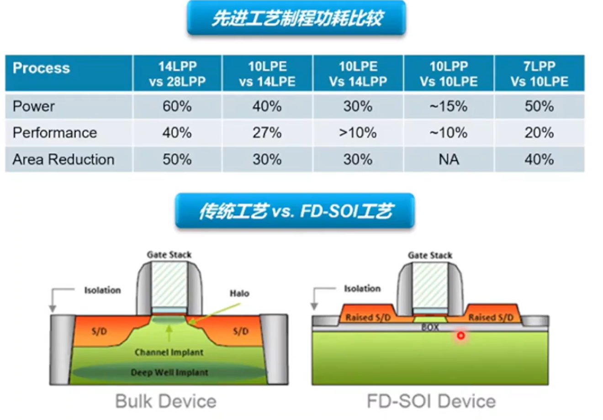
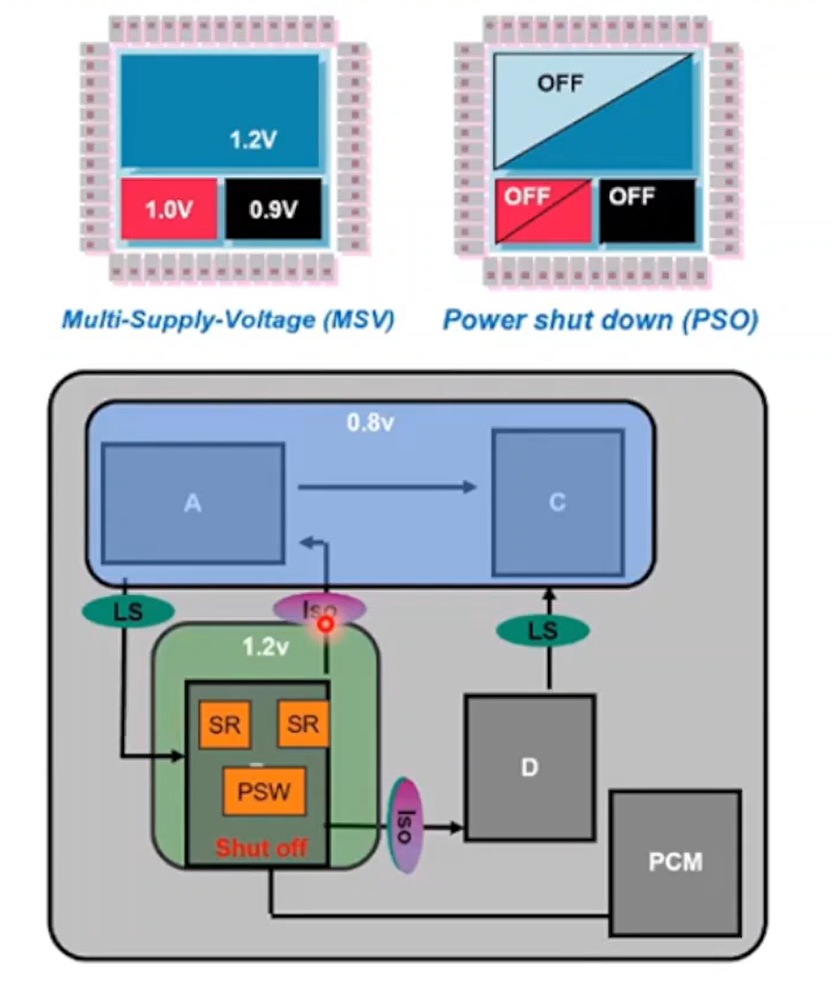
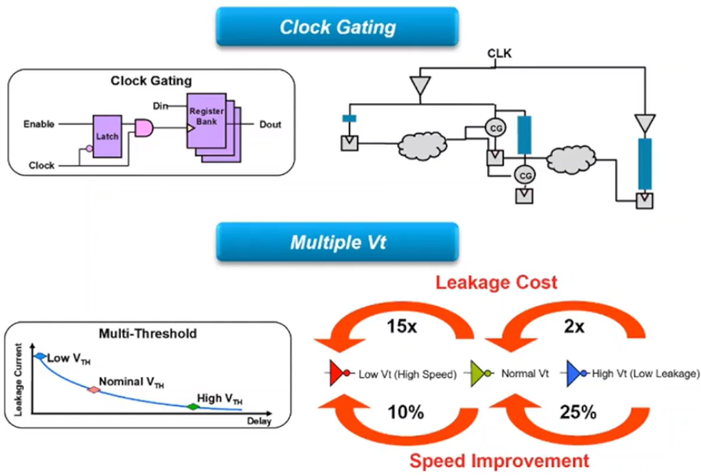
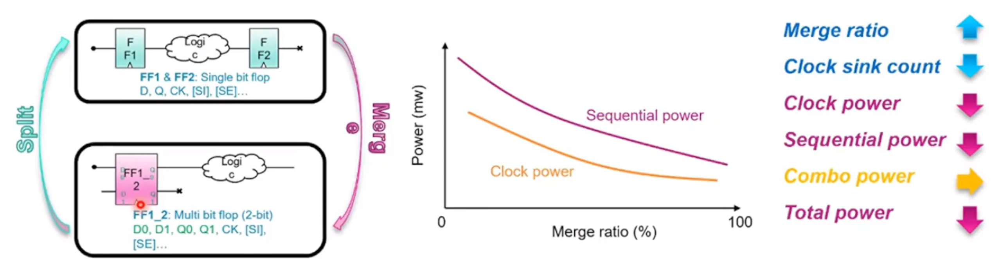
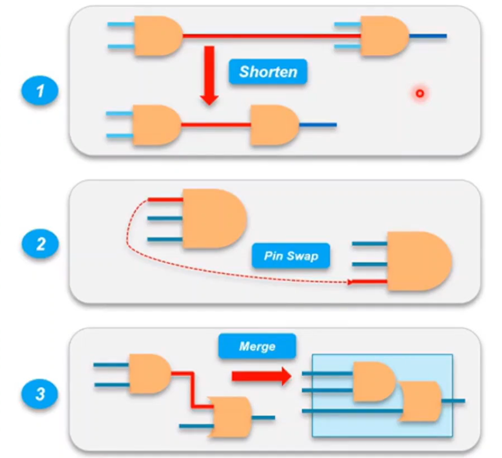
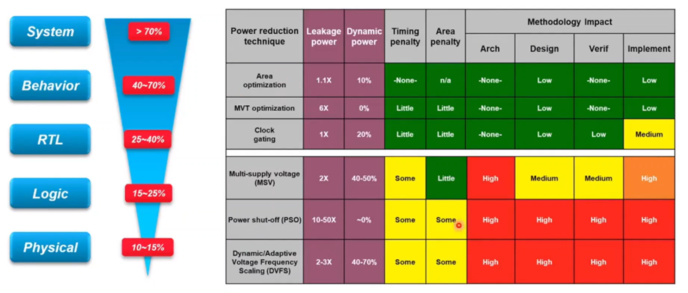

## 为什么需要低功耗设计？

- 便携式设备——电池寿命
- 桌面系统——高功耗
- 高功耗对系统的影响
  - 降低系统可靠性（温度升高，增加电子的迁移速度，连线的失效率上升）；
  - 降低系统性能（温度升高，降低载流子的迁移率，使得晶体管翻转时间增加，降低系统的性能）；
  - 增加生产和封装成本（高功耗需要更宽的电源线，增加面积；需要更好的散热介质）；
  - 增加系统的散热成本；
 
## 功耗类型

CMOS电路中的功耗分为动态功耗和静态功耗，公式为：

$$
P= \overbrace{   \underbrace{ \frac{1}{2}\cdot C \cdot V_{DD}^2\cdot f \cdot N_{sw}}_{翻转功耗}   +  \underbrace{ Q_{sc}\cdot V_{DD}\cdot f \cdot N_{sw}}_{短路功耗}  }^{动态功耗}+ \underbrace{\overbrace{I_{leak}\cdot V_{DD}}^{静态功耗}}_{漏电流功耗}
$$

其中$C$为负载电容，$V_{DD}$为电源电压，$f$为时钟频率，$N_{sw}$为开关次数，$Q_{sc}$为短路电荷，$I_{leak}$为漏电流。

### 动态功耗

包括翻转功耗和短路功耗。

#### 翻转功耗

CMOS电路翻转过程中引起的功耗。

电源中取得的能量为：

$$
E_{V_{DD}} = C_L \cdot V_{DD}^2
$$

存储在负载电容中的能量为：

$$
E_{C_L} = \frac{1}{2} \cdot C_L \cdot V_{DD}^2
$$

电源提供的能量只有一部分在负载电容上，另一部分消耗在MOS管上。

CMOS动态功耗的计算公式为：

$$
P_{dyn} = P_{0\to1}C_LV_{DD}^2f_{clk} \\
P_{dyn} \propto \alpha_{0\to1} \cdot f_{clk}  \cdot C_L \cdot V_{DD} \cdot V_{Swing} \\
E_{dyn} \propto \alpha_{0\to1}  \cdot C_L \cdot V_{DD} \cdot V_{Swing}
$$

##### 如何降低开关功耗

- 减小晶体管尺寸（$C_L$）：降低速度；
- 降低$V_{DD}$：降低速度；
- 减小电压摆幅（voltage swing）：降低下一级速度；
- 降低频率：不降低能耗；
- 降低翻转率：使用逻辑重组的方法等。

#### 短路功耗

输入信号变化的斜率造成了开关过程中$V_{DD}$和$V_{SS}$之间在短期内出现了一条直流通路，此时PMOS和NMOS同时导通，产生短路电流。

每翻转周期（上升+下降）的能量：

$$
E_{dp}=V_{DD}  \frac{(I_{peak} t_{sc})}{2}+V_{DD} \frac{ (I_{peak} t_{sc})}{2}=V_{DD} I_{peak} t_{sc}
$$

平均能量：

$$
P_{dp}=V_{DD}I_{peak}t_{sc}f=C_{sc}V_{DD}^2f
$$

短路功耗与翻转活动性成正比。

##### 如何降低短路功耗

- 降低电源电压可以减小短路功耗；
- 降低短路电流可以减小短路功耗；

##### 峰值短路电流分析

- 取决于器件的饱和电流，因此与器件的尺寸有关；
- 与$V_{DD}$有关，降低电源电压可以减小短路电流；
- 与负载电容$C_L$（输入输出的斜率之比）有关：小负载的短路电流较大。

##### 如何降低短路电流

- 加大负载，会使电路速度降低，且引起下一级门的大短路电流；
- 使IN/OUT的上升/下降时间匹配（使一个门的输入和输出上升时间相等或近似相等，就这个具体门本身而言并不是一个最优的结果却能保持整个短路电流在界定的范围内）；

#### 虚假翻转（Glitch）

电路信号翻转分为功能翻转和虚假翻转（或毛刺，源自delay不等于0）当门的两个输入信号不同时到达。

翻转功耗在当前的设计电路中仍然占主要部分，短路功耗在动态功耗中所占的比例较小。

### 静态功耗

静态功耗主要由这几部分构成：

- $I_1$：PN结反向偏置电流；
- $I_2$：**弱反型电流（亚阈值电流）；**
- $I_3$：**DIBL（漏端感应势垒降低）；**
- $I_4$：**GIDL（栅极感应漏端漏电）；**
- $I_5$：Punchthrough（源漏贯通）；
- $I_6$：窄宽度效应；
- $I_7$：栅氧隧穿；
- $I_8$：热电子注入；

#### 亚阈值导通

亚阈值电流公式：

$$
I_D=I_Se^{\frac{V_{GS}}{nkT/q}}(1-e^{\frac{V_{DS}}{kT/q}})(1+\lambda V_{DS})
$$

亚阈值电流是漏电的主要来源。

#### DIBL 

$V_T$和$V_{DS}$相关。

提高漏源电压会增加漏端结耗尽区的宽度，因此随着$V_{DS}$的增加阈值会降低，即所谓的“漏端感应势垒降低（DIBL）”。

#### 考虑DIBL效应和体效应对$V_T$的影响

$$
I_{DS}=I_{DS_0}e^{\frac{V_{GS} - V_{T_0}  +\eta V_{DS}-k_{\gamma}V_{SB}}{nv_T}}(1-e^{-\frac{V_{DS}}{V_T}})
$$

#### 温度影响

- 迁移率随温度升高而降低；
- 阈值电压随温度呈线性减小；
- 总体：与$V_{GS}$和温度都相关，温度翻转效应。

## 常用低功耗设计技术

- 工艺：
  - 随着工艺尺寸缩小，晶体管平均功耗降低
  - 特殊工艺，如FDSOI，可以大大降低芯片功耗
- 芯片架构
  - 多电压域架构（Multiple supply Voltage）
  - 电源关断（Power Shut Off）
  - 动态电压频率调节（DVFS）
- 芯片实现
  - 时钟门控（Clock Gating）
  - 多阈值电压 & 多沟道长度
  - 多位寄存器优化
  - 翻转率 & 负载系统优化

### 工艺

- 先进工艺制程
  - 先进工艺节点降低供电电压，提升性能、功耗与芯片集成度
- 特殊工艺制程
  - 一些特殊工艺制程，由于特殊晶体管特殊结构，也能够明显降低功耗例如: FD-SOI工艺
    - vs 16nm FinFET:平面工艺，低成本
    - vs 28nm:低漏电，高性能
- LPP工艺和LPE工艺是两种不同的半导体制程，它们都是针对不同的性能和功耗需求而设计的。LPP是Low Power Plus的缩写，意思是低功耗增强型，它相比于LPE（Low Power Early，低功耗早期型）有更高的性能和更低的功耗。LPP工艺一般是在LPE工艺成熟后推出的，它可以利用更优化的设计和工艺参数来提升芯片的表现。

    
     
    

      先进工艺制程PPA比较
  	

### 芯片架构

- 多电压域架构 (Multiple Supply Voltage)
  - 根据芯片不同模块时序特性，采用不用电压供电
    - 高速模块:高电压供电，晶体管延时小
    - 低速模块:低电压供电，晶体管延时大，功耗低
- 电源关断 (Power Shut off)
  - 根据芯片的工作模式，在模块不需要工作时，关断电源供电
    - 节省芯片漏电功耗与翻转功耗(例如，时钟网络的翻转功耗)
- 芯片实现影响:
  - 需要特殊电源管理库文件 (PMK Kits) : Power Switch /lsolation /StateRetention / Always On Cell / Voltage Regulator / Level Shifter
  - 增加芯片电源网络设计复杂度:多电源网络设计，Power Gating 单元相关分析，低功耗单元供电分析
- 动态电压频率调节(DVFS: Dynamic Voltage and Frequency Scaling）
  - 根据模块工作模式，动态调节模块的工作频率和电压
    - 节约芯片翻转功耗&内部功耗
- 增加时序收敛难度
  - STA需要分析大量的工作模式，保证芯片时序收敛
  - 时钟域切换、模式切换需要特殊控制

    
     
    

      多电压域架构/电源关断
  	

### 芯片实现

- 时钟门控(Clock Gating)
  - 在寄存器时钟端加入门控逻辑，减少时钟网络的翻转功耗
- 多阈值电压&多沟道长度
  - 多阈值电压: HVT/RVT/LVT/SLVT单元速度变快，漏电变大
  - 多沟道长度:C14/C16，沟道越长，速度越慢，漏电越小
  - 采用“多阈值电压&多沟道长度”技术，关键路径采用“高速&高功耗单元”实现，非关键路径采用“低速&低功耗单元实现
- 芯片实现影响
  - 增加时序分析收敛，提高时钟树要求
  - 需要丰富的设计经验，在有限的设计周期内完成时序、功耗的优化与收敛

    
     
    

      时钟门控/多阈值电压单元
  	

  

- 多位寄存器优化(Multi-Bit Register)
  - 将Single-Bit DFF 合并为 Multi-Bit DFF (2-Bit、Bit)，降低 DFF 总面积和功耗，降低时钟网络面积和功耗
- 芯片实现影响:
  - 选择合适的MB单元，并且保证芯片局部密度，保证绕通性

    
     
    

      多位寄存器优化
  	

- 翻转率&负载协同优化
  - 原理:减小高翻转率信号的负载，降低 Switching &Interna/功耗
- 实现举例
  - 例子1:缩短高翻转率信号线的长度，从而减小线上负载
  - 例子2:将高翻转率信号接到低内部负载的单元输入端口
  - 例子3:将高翻转率信号线两端的单元合并为一个单元，变外部负载为内部负载
- 芯片实现影响
  - 考虑时序、绕线影响
  - Toggle文件反标率

    
     
    

      低功耗实现示例（shorten/pin swap/merge）
  	

  

## 低功耗设计技术总结

五个层次上对系统的功耗进行优化：

- 系统级优化：软硬件协同设计、用户ISA、算法优化和协同综合等方法，最多可以节省大于70%功耗；
- 行为级优化：排序、流水线及行为转换等优化方法，最多可以节省40%~70%的功耗；
- RTL级优化：停时钟、预计算、操作数隔离、状态分配等计数，最多可以节省25%~40%的功耗；
- 逻辑级优化：逻辑重构、工艺映射、重新分配引脚的顺序和相位等方法，最多可以节省15%~25%的功耗；
- 物理级优化：扇出的优化、晶体管的大小调整、分块时钟树设计和毛刺的消除等，最多可以节省10%~15%的功耗。

    
     
    

      系统功耗优化层次
  	

  