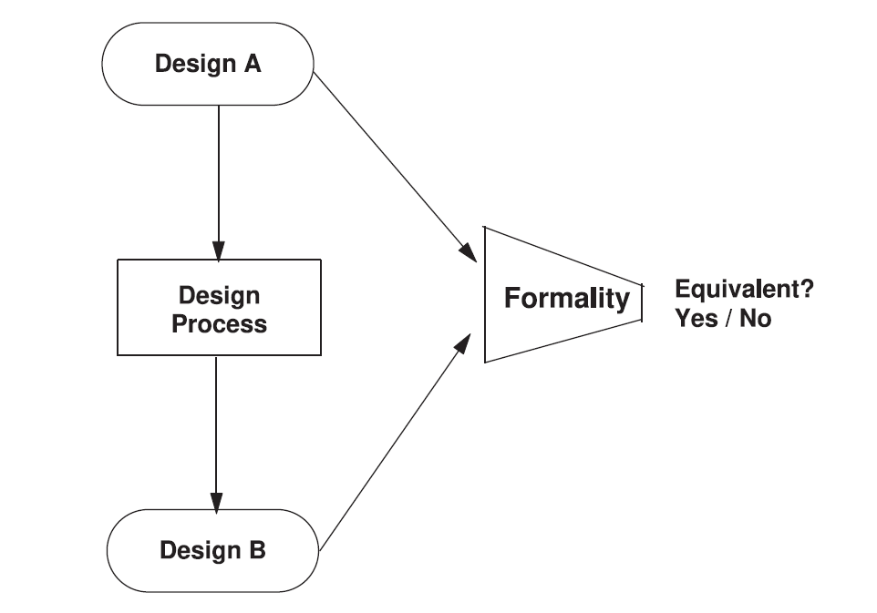
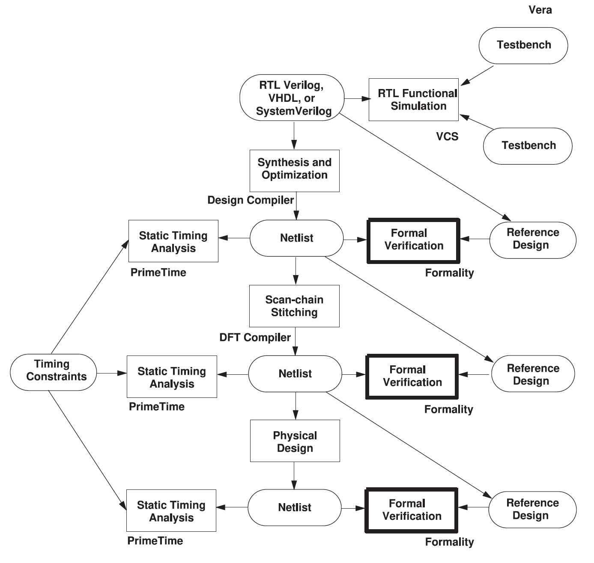
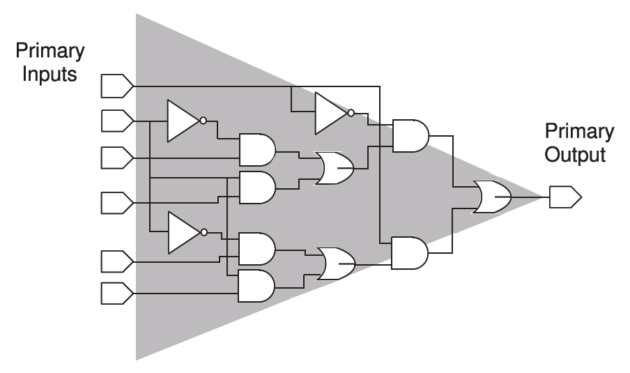
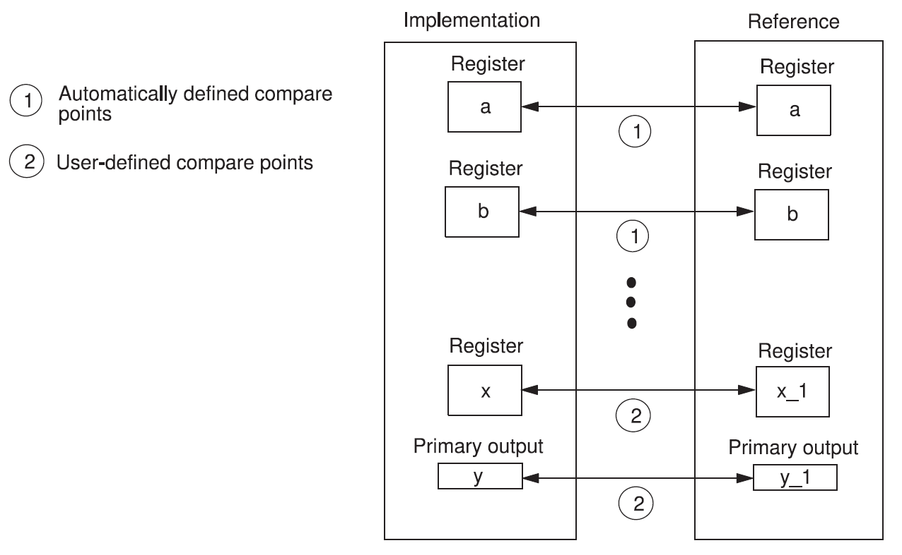

本文档是 Formality® User Guide Version V-2023.12-SP3, April 2023 的中文翻译版本，旨在为中文用户提供更易于理解的形式验证学习资料，如有翻译不当的地方，欢迎发送邮件进行指正。

<h2 id="1.">1. Formality介绍</h2>

这章向您介绍了Formality应用程序。内容包括以下几个部分：

* [1.1 Formality工具概述](#1.1)

* [1.2 一般验证过程](#1.2)

* [1.3 通过等效性检查验证设计](#1.3)

* [1.4 结果解释](#1.4)

<h3 id="1.1">1.1 Formality工具概述</h3>

Formality工具使用形式化验证比较引擎来证明或反驳两个给定设计的等价性，并提出所有区别供后续详细分析。

<h4 id="1.1.1">1.1.1 形式验证介绍</h4>

形式验证是仿真验证的一种替代。通过仿真进行验证的方法是将大量输入向量应用于电路，然后将产生的输出向量与预期值进行比较。随着设计变得越来越大、越来越复杂，需要的仿真向量也越来越多，使用传统仿真工具进行回归测试成为设计流程中的一个瓶颈。

瓶颈由以下这些因素造成：

- 需要大量的仿真向量才能确保设计符合所需的规格要求；
- 由于设计规模和复杂性增加，逻辑仿真器必须为每个激励向量处理更多的事件；
- 更多的向量和更大的设计规模导致内存交换增加，从而降低性能。

形式验证使用数学技术将待验证的逻辑与逻辑规范或参考设计进行比较。与通过仿真进行验证不同，形式验证不需要输入向量。由于形式验证在比较过程中只考虑逻辑功能，因此它独立于设计的物理属性，如布局和时序。

形式验证真正的强大之处在于其能够呈现未预期的差异，而无需依赖于向量集，因此在提供百分之百的覆盖率的同时，能够比仿真更快地验证大型设计。

形式验证包含两个不同的基本工具：等价性检查器和模型检查器。等价性检查器证明一个设计是否在逻辑上与另一个设计等价。也就是说，它们用于证明两个电路在所有条件下都表现出相同的行为，尽管表示不同。他们使用形式化方法来实现这一点，不需要仿真向量。Formality工具是一种等价性检查器。

模型检查器则证明设计是否遵循一组指定的逻辑属性。

<h3 id="1.2">1.2 一般验证过程</h3>

Formality工具在执行某些设计方法流程前后，详细说明并比较两组设计文件。Formality在整个设计流程中使用，以确保设计描述在不同表示形式下逻辑上是等效的。

<h4 id="1.2.1">1.2.1 单独验证</h4>

图1显示了单个设计过程的基本验证流程。Formality工具读取表示参考设计A的文件，并对实现设计B执行相同操作。该工具确定设计中的哪些点是候选比较点，在两个设计之间适当地匹配它们，并执行形式等效性检查，报告检测到的任何差异。

    
     
    

      图1 使用 Formality 的验证流程
  	

<h4 id="1.2.2">1.2.2 ASIC验证流程</h4>

每个单独的验证只是一般ASIC验证流程中执行的众多验证之一。下图显示了这种验证链如何与设计流程并行，从初始RTL描述开始。

图2显示了使用Formality的ASIC验证流程。

    
     
    

      图2 使用 Formality 的 ASIC 验证流程
  	

<h3 id="1.3">1.3 通过等效检查验证设计</h3>

使用等效检查进行设计验证是一个四阶段的过程：
1. 读取并展开语言描述为逻辑表示。
2. 设置以预防差异。
3. 映射设计对之间的对应信号（匹配）。
4. 比较驱动映射信号的逻辑锥（验证）。

<h4 id="1.3.1">1.3.1 读取和展开设计</h4>

Formality 通过读取一组用户定义的设计和库文件开始验证，并将它们展开为适合等效检查的格式，完全表示用户定义的顶层模型的逻辑。在此阶段，您需要建立参考设计和实现设计，以及相应的比较点和逻辑锥。

<h4 id="1.3.1.1">1.3.1.1 参考设计和实现设计的概念</h4>

该工具测试参考设计和实现设计的等效性。

| 参考设计 | 这个设计是黄金设计，是 Formality 用于测试等效性的标准。      |
| -------- | ------------------------------------------------------------ |
| 实现设计 | 实现设计是更改后的设计。它是你想要证明其正确性的设计。例如，新综合的设计是源 RTL 设计的实现。 |

在 Formality 证明实现设计与已知参考设计等效后，你可以将实现设计设为新的参考设计。这种技术在回归测试期间将整体验证时间降至最低。相反，完成整个设计方法学并将签核网表与原始 RTL 进行验证可能会导致验证困难和更长的整体验证时间。

在 Formality 命令行界面（`fm_shell`）或 GUI 环境中，你可以将读入 Formality 的设计指定为实现设计或参考设计。没有特殊要求限制你的设计。然而，在任何给定时间，Formality 环境中只能有一个实现设计和一个参考设计。

<h4 id="1.3.1.2">1.3.1.2 逻辑锥的概念</h4>

逻辑锥由起始于特定设计对象的组合逻辑组成，并向后扩展至终止于某些设计对象的输出。Formality 用于创建比较点的设计对象是逻辑锥的起始点。比较点可以是主输出、内部逻辑锥的终止点、寄存器、黑盒输入引脚，或由多个驱动器驱动的网络，其中至少一个驱动器是端口或黑盒。逻辑锥终止的设计对象是主输入或比较点。图3展示了逻辑锥的概念。

    
     
    

      图3 逻辑锥
  	

在图3中，比较点是一个主输出。Formality 在验证过程中将此主输出的逻辑功能与另一个设计中匹配的主输出的逻辑功能进行比较。图中阴影部分表示主输出的逻辑锥。逻辑锥从端口的输入网络开始，向后延伸至终止点。在此示例中，终止点是连接到主输入的网络。

<h3 id="1.3.2">1.3.2 设置以预防差异</h3>

在被比较的两个设计中可能存在预期的功能差异。在这些情况下，需要进行设置以考虑这些差异，避免误判。例如，在实现设计中添加扫描逻辑。你仍然可以通过在实现设计中设置一个常量来禁用扫描逻辑，从而检查实现设计的非扫描功能是否与参考设计匹配。

<h4 id="1.3.2.1">1.3.2.1 指导的概念</h4>

指导有助于等效检查工具理解和处理由设计流程中使用的其他工具引起的设计变更。Formality 使用指导信息来辅助比较点匹配，正确设置验证而无需用户干预，并更好地理解复杂的算术变换。

<h4 id="1.3.2.2">1.3.2.2 黑盒的概念</h4>

黑盒是功能未知的设计实例。黑盒通常用于设计中未综合的组件。常见的黑盒包括 RAM、ROM、模拟电路和硬 IP 块。黑盒的输入被视为比较点，黑盒的输出被视为其他逻辑锥的输入点。

在等效检查中使用黑盒时，确保参考设计和实现设计之间的一对一映射非常重要。否则，比较点会导致失败。你可以指定工具如何处理黑盒。这些技术在“处理黑盒”中有详细说明。

<h4 id="1.3.2.3">1.3.2.3 约束的概念</h4>

设置外部约束有助于限制在验证过程中考虑的输入值组合数量。设置约束可以减少验证时间，并消除因考虑未使用或非法的输入值组合而导致的潜在误判。通过对主输入、寄存器和黑盒输出的允许值和关系设置约束，并将这些信息提供给验证引擎，验证结果将仅限于识别参考设计和实现设计之间允许状态导致的差异。

有关约束的更多信息，请参见“指定外部约束”。

<h3 id="1.3.3">1.3.3 匹配</h3>

在设计验证之前，Formality 尝试将实现设计中的每个主输出、时序元件、黑盒输入引脚和合格网络与参考设计中的可比较设计对象进行匹配。有关如何匹配比较点的更多信息，请参见“执行比较点匹配”。

为了让 Formality 执行完整验证，所有比较点必须是可验证的。参考设计和实现设计中的设计对象之间必须有一对一的对应关系。然而，在测试设计一致性时，有些情况不需要一对一的对应关系也能实现完整验证。例如：

- 包含额外主输出的实现设计。
- 实现设计或参考设计包含额外的寄存器，并且在验证过程中没有比较点失败。

比较点主要通过设计中的对象名称进行匹配。如果设计中的对象名称不同，Formality 会使用各种方法自动匹配这些比较点。当所有自动方法都失败时，你也可以手动匹配这些对象名称。

<h4 id="1.3.3.1">1.3.3.1 比较点的概念</h4>

比较点是验证过程中用作组合逻辑端点的设计对象。比较点可以是输出端口、寄存器、锁存器、黑盒输入引脚，或由多个驱动器驱动的网络。

Formality 使用以下设计对象自动创建比较点：

- 主输出
- 时序元件
- 黑盒输入引脚
- 由多个驱动器驱动的网络，其中至少一个驱动器是端口或黑盒

Formality 通过比较实现设计中的比较点逻辑锥与参考设计中匹配的比较点逻辑锥来验证比较点，如图4所示。

<h4 id="1.3.3.2">1.3.3.2 用户匹配的概念</h4>

Formality 在验证过程中会自动匹配实现设计和参考设计之间尽可能多的端口和组件。如果这些自动方法无法确定匹配，你可以使用命令手动创建这些匹配。

Formality 中的比较点匹配技术大致分为两类：

- 基于名称的匹配
- 非基于名称的匹配

实现设计或参考设计中未匹配的设计对象会被报告为失败的比较点，并附有说明，指示在参考设计中没有可比较的设计对象。

有时你可能需要提供信息，以便 Formality 在验证之前匹配所有设计对象。例如，实现设计和参考设计可能包含名称不同但其他方面可比较的设计对象。然而，Formality 无法使用其匹配算法（包括签名分析）进行匹配。在这种情况下，你可以使用几种方法自己映射设计对象名称。有关匹配不同名称的设计对象的更多信息，请参见“调试未匹配点”。

图4展示了自动和用户定义的比较点组合如何实现完整验证的示例。当 Formality 使用正常匹配技术或签名分析匹配两个设计对象的名称和类型时，会自动创建比较点。当你采取步骤在设计对象之间映射名称时，会创建用户定义的比较点。

    
     
    

      图4 构建比较点
  	

有关匹配不同名称的设计对象的更多信息，请参见“使用用户提供的名称进行匹配”。有关比较点状态消息，请参见“报告和解释结果”。

<h3 id="1.3.4">1.3.4 验证</h3>

验证是等效检查的主要功能。默认情况下，Formality 在验证设计或逻辑库时检查一致性。

<h4 id="1.3.4.1">1.3.4.1 一致性验证的概念</h4>

设计等效性一词指的是验证测试目标。Formality 可以测试两种类型的设计等效性：设计一致性和设计等效性。

**设计一致性**

对于参考设计定义为1或0响应的每个输入模式，实现设计给出相同的响应。如果参考设计中存在不关心（X）条件，则在实现设计中的等效点为0或1时，验证通过。

**设计等效性**

包括设计一致性和附加要求。实现设计和参考设计的功能必须对完全相同的输入模式集进行定义。如果参考设计中存在不关心（X）条件，则只有在实现设计中的等效点为X时，验证才通过。

<h2 id="1.4">1.4 结果解释</h2>

当 Formality 证明匹配的比较点对（一个来自参考设计，一个来自实现设计）的逻辑锥定义的功能在功能上等效时，结果是参考设计和实现设计中的比较点都具有通过状态。如果参考设计中的所有比较点都通过验证，则整个设计的最终验证结果为成功验证。
